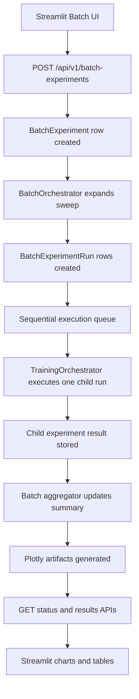
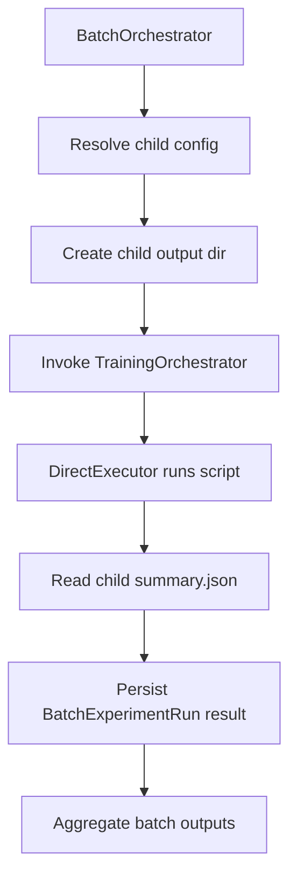

# Batch Experiments Architecture Design

## Overview

This document defines the architecture for batch experiment execution in [`walaris-cen`](walaris-cen), enabling parameter sweep experiments with AUROC aggregation and visualization.

The design is aligned with the current single-experiment flow implemented around:
- [`TrainingConfig`](walaris-cen/backend/app/domain/models.py:8)
- [`TrainingResult`](walaris-cen/backend/app/domain/models.py:74)
- [`DirectExecutor`](walaris-cen/backend/app/services/executors/direct_executor.py:28)
- [`TrainingStage`](walaris-cen/backend/app/domain/value_objects.py:9)
- existing experiment endpoints in [`experiments.py`](walaris-cen/backend/app/api/routes/experiments.py:114)

## Goals

The feature must support:

1. Sweeping any configurable experiment parameter
2. Defining a numeric range with start, end, and step
3. Executing experiments sequentially in batch order
4. Aggregating AUROC metrics across the sweep
5. Visualizing epistemic and aleatoric AUROC versus swept parameter
6. Persisting all artifacts in a dedicated batch directory structure

## Version Scope

### V1
V1 supports **one swept parameter per batch** and many generated child experiments.

### V2 Ready
The schema, API, and storage are intentionally designed to extend to:
- multiple swept parameters
- Cartesian grids
- conditional sweeps
- parallel execution

The core extension point is that sweep definitions are stored as a list, even though V1 validates exactly one active sweep definition.

---

# 1. Architecture Summary

## High-Level Flow



## Architectural Principles

1. Reuse existing single-experiment execution wherever possible
2. Introduce a dedicated batch orchestration layer above [`TrainingOrchestrator`](walaris-cen/backend/app/api/routes/experiments.py:21)
3. Preserve experiment-level outputs for debugging and reproducibility
4. Store machine-readable aggregation artifacts in stable formats
5. Keep V1 sequential to reduce concurrency and resource complexity
6. Make the data model future-proof for multi-parameter sweeps

---

# 2. Domain Model

## Existing Baseline

The existing domain exposes a flattened experiment config in [`TrainingConfig`](walaris-cen/backend/app/domain/models.py:8), which maps to YAML via [`TrainingConfig.to_yaml_dict()`](walaris-cen/backend/app/domain/models.py:33).

That baseline remains the source of truth for a single child experiment. Batch execution wraps this model with sweep metadata and a set of generated child runs.

## New Core Concepts

### BatchExperiment
Represents one user-created batch job.

### BatchSweepDefinition
Describes the parameter to sweep and how values are generated.

### BatchExperimentRun
Represents one generated child experiment execution inside the batch.

### BatchAggregatedResult
Represents derived, batch-level summary metrics and chart artifact metadata.

---

# 3. Database Schema Design

## 3.1 New Tables

## `batch_experiment`

Represents one batch request.

### Columns

- `id: UUID` primary key
- `name: str`
- `description: str | null`
- `status: JobStatus`
- `progress: float`
- `created_at: datetime`
- `started_at: datetime | null`
- `completed_at: datetime | null`
- `error_message: str | null`
- `created_by_id: UUID` foreign key to user
- `base_config_yaml: text`
- `sweep_definitions_json: text`
- `execution_mode: str`
- `storage_root: str`
- `total_runs: int`
- `completed_runs: int`
- `failed_runs: int`
- `successful_runs: int`
- `current_run_index: int | null`
- `results_summary_json: text | null`

### Notes

- `status` should reuse the existing [`JobStatus`](walaris-cen/backend/app/api/routes/experiments.py:22) enum if semantically compatible.
- `base_config_yaml` stores the fixed config shared by all child runs.
- `sweep_definitions_json` stores a list, even in V1.
- `storage_root` points to the batch folder, for example `/tmp/walaris_experiments/batch_<id>`.
- `results_summary_json` is a cached snapshot for fast status queries.

## `batch_experiment_run`

Represents one concrete generated run.

### Columns

- `id: UUID` primary key
- `batch_experiment_id: UUID` foreign key
- `run_index: int`
- `run_name: str`
- `status: JobStatus`
- `progress: float`
- `created_at: datetime`
- `started_at: datetime | null`
- `completed_at: datetime | null`
- `error_message: str | null`
- `swept_parameter: str`
- `swept_value_numeric: float | null`
- `swept_value_text: str`
- `resolved_config_yaml: text`
- `output_dir: str`
- `experiment_id: UUID | null`
- `aleatoric_auroc: float | null`
- `epistemic_auroc: float | null`
- `train_size: int | null`
- `eval_sizes_json: text | null`
- `result_summary_json: text | null`

### Notes

- `experiment_id` optionally links to the existing `UncertaintyExperiment` row if the implementation chooses to create one child experiment record per run.
- `resolved_config_yaml` stores the fully materialized child config after sweep substitution.
- `swept_value_text` preserves exact formatting for display and path naming.
- `swept_value_numeric` supports sorting and plotting.

## Optional Future Table: `batch_experiment_artifact`

Not required for V1, but useful if artifact indexing becomes important.

### Columns

- `id: UUID`
- `batch_experiment_id: UUID`
- `run_id: UUID | null`
- `artifact_type: str`
- `relative_path: str`
- `metadata_json: text | null`

---

## 3.2 Pydantic and SQLModel Additions

### New SQLModel entities
Recommended additions in the tables layer:
- `BatchExperiment`
- `BatchExperimentRun`

### New API request and response models
Recommended additions in the API layer:
- `BatchExperimentCreate`
- `BatchSweepDefinitionRequest`
- `BatchExperimentResponse`
- `BatchExperimentRunResponse`
- `BatchExperimentResultsResponse`

---

# 4. Sweep Configuration Model

## V1 Request Shape

```yaml
name: hidden_dim_sweep
base_config:
  noise_type: worse_label
  under_supported_classes: 3,5
  under_train_per_class: 50
  regular_train_per_class: 300
  eval_per_group: 600
  dinov2_model: small
  hidden_dim: 256
  dropout: 0.2
  epochs: 12
  learning_rate: 0.001
  weight_decay: 0.0001
  train_batch_size: 256
  mc_passes: 20
  attribution_method: dualxda

sweep_definitions:
  - parameter: hidden_dim
    value_type: int
    range:
      start: 64
      end: 512
      step: 64
```

## Sweep Definition Fields

### `parameter`
A dotless config field name in V1, matching a field from [`TrainingConfig`](walaris-cen/backend/app/domain/models.py:8).

Examples:
- `under_train_per_class`
- `regular_train_per_class`
- `eval_per_group`
- `hidden_dim`
- `dropout`
- `epochs`
- `learning_rate`
- `train_batch_size`
- `mc_passes`

### `value_type`
One of:
- `int`
- `float`

V1 should reject non-numeric sweep parameters because the requirement is based on start, end, and step.

### `range.start`
Inclusive starting value.

### `range.end`
Inclusive target ceiling if exactly reachable by step. If floating-point drift occurs, the implementation should clamp using decimal-safe arithmetic.

### `range.step`
Must be positive and non-zero.

## Parameter Validation Rules

1. The parameter must exist on [`TrainingConfig`](walaris-cen/backend/app/domain/models.py:8)
2. The generated values must satisfy field constraints from [`TrainingConfig`](walaris-cen/backend/app/domain/models.py:12)
3. V1 accepts exactly one sweep definition
4. Generated value count must be capped to avoid runaway batches
5. Sweep values must be unique after normalization

## Recommended Value Count Limits

- soft warning above 20 runs
- hard cap at 100 runs for V1

---

# 5. API Design

## 5.1 Endpoints

Required endpoints:

- `POST /api/v1/batch-experiments`
- `GET /api/v1/batch-experiments/{id}`
- `GET /api/v1/batch-experiments/{id}/results`

Recommended additional V1 endpoints:

- `GET /api/v1/batch-experiments`
- `POST /api/v1/batch-experiments/{id}/start`
- `GET /api/v1/batch-experiments/{id}/runs`
- `GET /api/v1/batch-experiments/{id}/artifacts`
- `GET /api/v1/batch-experiments/{id}/plot-data`

The additional endpoints are not strictly required for the initial scope, but they substantially simplify UI development.

---

## 5.2 `POST /api/v1/batch-experiments`

Creates the batch and optionally enqueues it.

### Request

```json
{
  "name": "hidden_dim_sweep_may16",
  "description": "Compare AUROC sensitivity to hidden layer size",
  "base_config": {
    "noise_type": "worse_label",
    "under_supported_classes": "3,5",
    "under_train_per_class": 50,
    "regular_train_per_class": 300,
    "eval_per_group": 600,
    "dinov2_model": "small",
    "hidden_dim": 256,
    "dropout": 0.2,
    "epochs": 12,
    "learning_rate": 0.001,
    "weight_decay": 0.0001,
    "train_batch_size": 256,
    "mc_passes": 20,
    "attribution_method": "dualxda"
  },
  "sweep_definitions": [
    {
      "parameter": "hidden_dim",
      "value_type": "int",
      "range": {
        "start": 64,
        "end": 512,
        "step": 64
      }
    }
  ],
  "auto_start": true
}
```

### Behavior

1. Validate request
2. Expand sweep values
3. Create [`BatchExperiment`](walaris-cen/BATCH_EXPERIMENTS_DESIGN.md) row with status `pending`
4. Create all [`BatchExperimentRun`](walaris-cen/BATCH_EXPERIMENTS_DESIGN.md) child rows with resolved configs
5. Materialize storage root and `batch_config.yaml`
6. If `auto_start` is true, start orchestration asynchronously
7. Return batch metadata

### Response

```json
{
  "id": "uuid",
  "name": "hidden_dim_sweep_may16",
  "status": "pending",
  "progress": 0.0,
  "total_runs": 8,
  "completed_runs": 0,
  "failed_runs": 0,
  "successful_runs": 0,
  "sweep_definitions": [
    {
      "parameter": "hidden_dim",
      "value_type": "int",
      "range": {
        "start": 64,
        "end": 512,
        "step": 64
      },
      "generated_values": [64, 128, 192, 256, 320, 384, 448, 512]
    }
  ],
  "created_at": "2026-05-16T10:00:00Z"
}
```

---

## 5.3 `GET /api/v1/batch-experiments/{id}`

Returns batch status and run-level progress summary.

### Response

```json
{
  "id": "uuid",
  "name": "hidden_dim_sweep_may16",
  "status": "running",
  "progress": 0.42,
  "created_at": "2026-05-16T10:00:00Z",
  "started_at": "2026-05-16T10:00:05Z",
  "completed_at": null,
  "current_run_index": 4,
  "total_runs": 8,
  "completed_runs": 3,
  "successful_runs": 3,
  "failed_runs": 0,
  "storage_root": "/tmp/walaris_experiments/batch_uuid",
  "sweep_summary": {
    "parameter": "hidden_dim",
    "value_type": "int",
    "generated_values": [64, 128, 192, 256, 320, 384, 448, 512]
  },
  "runs": [
    {
      "run_index": 1,
      "status": "completed",
      "swept_parameter": "hidden_dim",
      "swept_value": 64,
      "aleatoric_auroc": 0.81,
      "epistemic_auroc": 0.88
    }
  ],
  "error_message": null
}
```

### Notes

- For large run counts, `runs` can be omitted unless `include_runs=true`.
- The endpoint should be fast and read from cached summary fields where possible.

---

## 5.4 `GET /api/v1/batch-experiments/{id}/results`

Returns aggregated results and visualization metadata.

### Response

```json
{
  "batch_experiment_id": "uuid",
  "status": "completed",
  "swept_parameter": "hidden_dim",
  "x_axis_label": "hidden_dim",
  "series": [
    {
      "metric": "epistemic_auroc",
      "display_name": "Epistemic AUROC",
      "points": [
        { "x": 64, "y": 0.88, "run_index": 1, "status": "completed" },
        { "x": 128, "y": 0.90, "run_index": 2, "status": "completed" }
      ]
    },
    {
      "metric": "aleatoric_auroc",
      "display_name": "Aleatoric AUROC",
      "points": [
        { "x": 64, "y": 0.81, "run_index": 1, "status": "completed" },
        { "x": 128, "y": 0.82, "run_index": 2, "status": "completed" }
      ]
    }
  ],
  "comparison_table": [
    {
      "run_index": 1,
      "swept_value": 64,
      "aleatoric_auroc": 0.81,
      "epistemic_auroc": 0.88,
      "train_size": 2500,
      "results_path": "/tmp/walaris_experiments/batch_uuid/experiments/exp_1_hidden_dim_64"
    }
  ],
  "artifacts": {
    "plot_json": "/tmp/walaris_experiments/batch_uuid/aggregated_results/auroc_curves.json",
    "plot_png": "/tmp/walaris_experiments/batch_uuid/aggregated_results/auroc_curves.png",
    "comparison_csv": "/tmp/walaris_experiments/batch_uuid/aggregated_results/comparison_table.csv",
    "summary_json": "/tmp/walaris_experiments/batch_uuid/aggregated_results/summary.json"
  }
}
```

---

# 6. Service and Orchestrator Design

## 6.1 Service Layer Additions

Recommended new services:

- `BatchExperimentService`
- `BatchSweepExpander`
- `BatchOrchestrator`
- `BatchResultsAggregator`
- `BatchStorageManager`
- `BatchVisualizationService`

## 6.2 Responsibilities

### `BatchSweepExpander`
Generates concrete parameter values and resolved child configs.

#### Inputs
- base [`TrainingConfig`](walaris-cen/backend/app/domain/models.py:8)
- one or more sweep definitions

#### Outputs
- ordered list of generated run specs

#### Responsibilities
- validate sweep parameter names
- enforce numeric type correctness
- generate stable ordered values
- produce run names and directory-safe tokens

### `BatchStorageManager`
Creates and manages on-disk structure.

#### Responsibilities
- create batch root directory
- write `batch_config.yaml`
- create child run directories
- write aggregated artifacts
- expose canonical relative paths

### `BatchOrchestrator`
Executes child runs sequentially and updates batch status.

#### Responsibilities
- mark batch started
- select next pending run
- call existing single-experiment execution flow
- persist child results
- update aggregate progress
- handle failure policy
- trigger aggregation after each run and on completion

### `BatchResultsAggregator`
Builds comparison tables and summary documents.

#### Responsibilities
- collect completed run metrics
- sort by swept numeric value
- compute best run and summary stats
- write CSV and JSON
- provide response DTOs for API endpoints

### `BatchVisualizationService`
Builds Plotly figure definitions and image outputs.

#### Responsibilities
- generate interactive figure JSON
- generate static PNG if image export is available
- standardize axis labels, legends, and hover text

---

## 6.3 Reuse of Existing `TrainingOrchestrator`

The batch design should **wrap**, not replace, the current single-run orchestration.

### Proposed layering



## Design Decision

`BatchOrchestrator` should delegate each child run to the same execution path currently used for individual experiments.

This gives:
- minimal duplication
- consistent result parsing
- same progress stage semantics from [`TrainingStage`](walaris-cen/backend/app/domain/value_objects.py:9)

## Implementation Pattern Options

### Option A: Child runs create `UncertaintyExperiment` records
Pros:
- maximizes reuse
- existing UI and repositories remain relevant
- child runs are visible in current experiment history

Cons:
- duplicates metadata across batch and experiment tables
- requires linking and filtering

### Option B: Child runs exist only in batch tables
Pros:
- cleaner batch ownership model
- less duplication

Cons:
- more new orchestration code
- less reuse of existing repository patterns

## Recommendation

Choose **Option A for V1**.

Create one existing `UncertaintyExperiment` row per child run and link it from `batch_experiment_run.experiment_id`.

This allows:
- direct reuse of current config serialization patterns in [`_create_experiment_impl`](walaris-cen/backend/app/api/routes/experiments.py:137)
- reuse of result parsing assumptions from [`DirectExecutor._read_results()`](walaris-cen/backend/app/services/executors/direct_executor.py:186)
- easier debugging through existing experiment tooling

---

# 7. Execution Semantics

## Sequential Queue

V1 executes runs strictly one after another.

### Why sequential first
- ML jobs are expensive
- avoids GPU and memory contention
- easier progress accounting
- simpler failure recovery
- deterministic artifact timing

## Failure Policy

Recommended default:
- continue batch after individual run failure
- mark failed child run with error message
- batch status becomes:
  - `completed` if all succeed
  - `completed_with_errors` if at least one fails
  - `failed` only if orchestration itself crashes before completing the queue

If the existing [`JobStatus`](walaris-cen/backend/app/api/routes/experiments.py:22) enum lacks `completed_with_errors`, add batch-specific mapping logic or extend the enum.

## Progress Calculation

### Batch progress
```text
batch_progress =
completed_runs / total_runs
+ current_run_progress / total_runs
```

Example:
- total runs = 8
- 3 runs complete
- current run at 40 percent

Progress:
- `3 / 8 + 0.4 / 8 = 0.425`

## WebSocket Extension

The existing WebSocket endpoint in [`websocket.py`](walaris-cen/backend/app/api/routes/websocket.py:18) is experiment-specific.

Recommended extension:
- new endpoint `/ws/batch-experiments/{batch_id}/progress`

### Message shape
```json
{
  "batch_id": "uuid",
  "status": "running",
  "progress": 0.425,
  "current_run_index": 4,
  "total_runs": 8,
  "current_run": {
    "run_index": 4,
    "swept_parameter": "hidden_dim",
    "swept_value": 256,
    "stage": "training_model",
    "message": "Epoch 4/12"
  }
}
```

---

# 8. Storage Structure

## Required Structure

```text
/tmp/walaris_experiments/batch_{id}/
├── batch_config.yaml
├── batch_metadata.json
├── experiments/
│   ├── exp_1_hidden_dim_64/
│   │   ├── config.yaml
│   │   ├── summary.json
│   │   ├── per_sample_results.csv
│   │   └── ...
│   ├── exp_2_hidden_dim_128/
│   └── ...
└── aggregated_results/
    ├── auroc_curves.json
    ├── auroc_curves.png
    ├── comparison_table.csv
    ├── summary.json
    └── run_status_table.csv
```

## File Definitions

### `batch_config.yaml`
Top-level batch request with:
- base config
- sweep definitions
- generated values
- creation metadata

### `batch_metadata.json`
Operational metadata:
- batch id
- status
- counters
- timestamps
- storage paths

### `experiments/exp_N_param_value/config.yaml`
The fully resolved child config passed to the ML script.

### `experiments/exp_N_param_value/summary.json`
Produced by the existing training pipeline and parsed by [`DirectExecutor._read_results()`](walaris-cen/backend/app/services/executors/direct_executor.py:186).

### `aggregated_results/comparison_table.csv`
Tabular summary of all runs.

### `aggregated_results/run_status_table.csv`
Operational report including failed runs and error messages.

### `aggregated_results/summary.json`
Machine-readable aggregate summary.

### `aggregated_results/auroc_curves.json`
Serialized Plotly figure for UI rendering and later reuse.

### `aggregated_results/auroc_curves.png`
Static chart export for sharing.

---

# 9. Aggregated Result Formats

## 9.1 Comparison Table CSV

### Columns

- `run_index`
- `run_name`
- `status`
- `swept_parameter`
- `swept_value`
- `aleatoric_auroc`
- `epistemic_auroc`
- `train_size`
- `results_path`
- `started_at`
- `completed_at`
- `duration_seconds`
- `error_message`

## 9.2 Summary JSON

Example:

```json
{
  "batch_experiment_id": "uuid",
  "name": "hidden_dim_sweep_may16",
  "status": "completed",
  "swept_parameter": "hidden_dim",
  "total_runs": 8,
  "successful_runs": 8,
  "failed_runs": 0,
  "best_epistemic_run": {
    "run_index": 6,
    "swept_value": 384,
    "epistemic_auroc": 0.92
  },
  "best_aleatoric_run": {
    "run_index": 4,
    "swept_value": 256,
    "aleatoric_auroc": 0.84
  },
  "series_summary": {
    "epistemic_auroc": {
      "min": 0.88,
      "max": 0.92,
      "mean": 0.905
    },
    "aleatoric_auroc": {
      "min": 0.81,
      "max": 0.84,
      "mean": 0.825
    }
  },
  "artifacts": {
    "comparison_table_csv": "aggregated_results/comparison_table.csv",
    "plot_json": "aggregated_results/auroc_curves.json",
    "plot_png": "aggregated_results/auroc_curves.png"
  }
}
```

---

# 10. Visualization Specification

## 10.1 Primary Chart

### Chart Type
Plotly line chart with markers.

### X-axis
Swept parameter value.

### Y-axis
AUROC score from 0.0 to 1.0.

### Series
- Epistemic AUROC
- Aleatoric AUROC

### Trace styling
- Epistemic: blue line with circle markers
- Aleatoric: orange line with diamond markers

### Hover template
Should include:
- run index
- swept parameter name
- swept value
- epistemic AUROC
- aleatoric AUROC
- status
- result path or run name

## 10.2 Secondary Visualizations

Recommended V1 additions:

### Comparison table
Sortable table with one row per run.

### Best-run summary cards
- best epistemic AUROC
- best aleatoric AUROC
- number of successful runs
- number of failed runs

### Optional dual-axis diagnostic chart
Not necessary for V1. A single y-axis is sufficient since both metrics share the same AUROC range.

## 10.3 Plotly JSON Shape

The API should return either:
- Plotly-ready `data` and `layout`, or
- a normalized series payload plus server-generated artifact paths

## Recommendation
Return normalized series in the API and also persist Plotly JSON to disk.

This makes the API stable even if charting libraries change later.

---

# 11. UI Design for Streamlit

## 11.1 Placement

Add a new section to [`streamlit_app.py`](walaris-cen/streamlit_app.py:98) under the experiments area:

- Single Experiment
- Batch Experiments

Use tabs or an expander structure.

## 11.2 New UI Components

Recommended additions in [`ui_components.py`](walaris-cen/ui_components.py:16):

- `render_batch_experiment_config`
- `render_sweep_parameter_selector`
- `render_sweep_range_inputs`
- `render_batch_run_preview`
- `render_batch_results_dashboard`

## 11.3 Batch Config Form

### Fields

#### Batch metadata
- batch name
- optional description

#### Base config
Reuse existing single experiment controls:
- epistemic controls from [`render_epistemic_config`](walaris-cen/ui_components.py:105)
- aleatoric controls from [`render_aleatoric_config`](walaris-cen/ui_components.py:201)
- model config
- training config
- evaluation config

#### Sweep config
- parameter select box
- numeric start
- numeric end
- numeric step
- generated value preview
- total run count preview
- validation warnings

## 11.4 Suggested UI Layout Mockup

```text
┌───────────────────────────────────────────────────────────────┐
│ Batch Experiments                                             │
├───────────────────────────────────────────────────────────────┤
│ Batch Name: [ hidden_dim_sweep_may16                    ]     │
│ Description: [ Compare AUROC sensitivity to hidden dim ]     │
├───────────────────────────────────────────────────────────────┤
│ Base Experiment Configuration                                 │
│  Reuse existing single experiment controls                    │
├───────────────────────────────────────────────────────────────┤
│ Sweep Configuration                                           │
│  Parameter: [ hidden_dim v ]                                  │
│  Start: [ 64 ]   End: [ 512 ]   Step: [ 64 ]                  │
│  Generated Values: 64, 128, 192, 256, 320, 384, 448, 512      │
│  Total Runs: 8                                                │
├───────────────────────────────────────────────────────────────┤
│ [ Create Batch ]  [ Create and Start ]                        │
└───────────────────────────────────────────────────────────────┘
```

## 11.5 Batch Status Dashboard Mockup

```text
┌───────────────────────────────────────────────────────────────┐
│ Batch Status: Running                                         │
│ Progress: 42 percent                                          │
│ Current Run: 4 of 8, hidden_dim = 256                         │
├───────────────────────────────────────────────────────────────┤
│ Metrics Cards                                                 │
│  Successful Runs: 3   Failed Runs: 0   Best Epistemic: 0.91   │
├───────────────────────────────────────────────────────────────┤
│ Plotly Chart: AUROC vs hidden_dim                             │
│  - Epistemic AUROC line                                       │
│  - Aleatoric AUROC line                                       │
├───────────────────────────────────────────────────────────────┤
│ Results Table                                                 │
│  run_index | swept_value | epistemic_auroc | aleatoric_auroc  │
└───────────────────────────────────────────────────────────────┘
```

## 11.6 UX Behavior

### On parameter change
- regenerate preview values immediately
- warn if run count exceeds recommended threshold

### On batch creation
- show created batch id
- optionally auto-navigate to status panel

### During execution
- poll status API every few seconds or use WebSocket
- update chart incrementally as completed points arrive

### On completion
- show downloadable CSV and static chart link
- highlight best runs

---

# 12. Integration with Current Codebase

## 12.1 Current Reuse Points

### Config reuse
[`TrainingConfig`](walaris-cen/backend/app/domain/models.py:8) should remain the canonical config definition.

### Result reuse
[`TrainingResult`](walaris-cen/backend/app/domain/models.py:74) should remain the canonical child result structure.

### Execution reuse
[`DirectExecutor.execute()`](walaris-cen/backend/app/services/executors/direct_executor.py:70) remains the low-level runner.

### Result parsing reuse
[`DirectExecutor._read_results()`](walaris-cen/backend/app/services/executors/direct_executor.py:186) defines the minimum required child output contract.

### API style reuse
[`experiments.py`](walaris-cen/backend/app/api/routes/experiments.py:27) provides the route pattern and request-response modeling style.

## 12.2 Recommended Code Additions

### Backend
- `backend/app/api/routes/batch_experiments.py`
- `backend/app/services/batch_orchestrator.py`
- `backend/app/services/batch_results_aggregator.py`
- `backend/app/services/batch_storage_manager.py`
- `backend/app/services/batch_visualization_service.py`
- `backend/app/repositories/batch_experiment_repository.py`

### Domain
- extend or add batch request and result models

### Persistence
- add SQLModel tables and migration for batch entities

### Frontend
- extend [`streamlit_app.py`](walaris-cen/streamlit_app.py:98)
- extend [`ui_components.py`](walaris-cen/ui_components.py:16)

---

# 13. Validation Rules

## Request Validation

1. `name` required
2. `sweep_definitions` required and length must equal 1 in V1
3. parameter must map to a numeric field
4. `step > 0`
5. `end >= start`
6. generated run count must not exceed configured cap
7. each generated value must satisfy the target field constraints
8. forbid sweeping unsupported string fields such as `noise_type` in V1 range mode

## Runtime Validation

1. storage root must be creatable
2. child configs must serialize to YAML
3. child output dir names must be filesystem-safe
4. duplicate generated directories must be rejected
5. aggregation must tolerate partial failure

---

# 14. Error Handling Strategy

## Per-run failures
Store:
- `status = failed`
- `error_message`
- timestamps
- partial logs if available

Continue to next run.

## Batch-level failures
If orchestration crashes:
- mark batch failed
- preserve already completed child results
- keep aggregated outputs up to last successful update

## Result aggregation failures
Do not erase existing child results.
Mark batch warning state via:
- `results_summary_json.status = degraded`
- attach aggregation error message

---

# 15. Future Extension Path

The design is intentionally extensible.

## Multi-parameter sweeps
Later, allow multiple entries in `sweep_definitions`.

### Expansion strategies
- Cartesian product
- zipped paired sweeps
- conditional sweep groups

## Parallel execution
Add:
- `max_concurrency`
- resource-aware scheduling
- GPU slot locking

## Non-range sweeps
Support:
- explicit value lists
- categorical parameters
- seed replication sweeps

## Replicates
Allow repeated runs per sweep point for confidence intervals:
- `replicates: N`
- summary charts with mean and standard deviation bands

---

# 16. Recommended Implementation Plan

## Phase 1
Data model and persistence
- add batch tables
- add migration
- add repository

## Phase 2
Core orchestration
- sweep expansion
- storage manager
- batch orchestrator wrapping single-run execution

## Phase 3
Aggregation and visualization
- comparison CSV
- summary JSON
- Plotly JSON and PNG

## Phase 4
API
- create, status, results, runs endpoints
- optional WebSocket endpoint

## Phase 5
Streamlit UI
- batch creation form
- preview panel
- status dashboard
- results chart and table

---

# 17. Concrete Recommendations

## Recommended V1 choices

### Schema
Use `BatchExperiment` plus `BatchExperimentRun`.

### Execution
Sequential only.

### Child runs
Create linked `UncertaintyExperiment` rows for maximum reuse.

### Aggregation
Recompute after each completed run so the UI can update progressively.

### Visualization
Use Plotly line-plus-marker chart with two series.

### Storage
Use dedicated batch directory under `/tmp/walaris_experiments/batch_<id>`.

### API shape
Store sweep definitions as a list, but validate exactly one definition in V1.

---

# 18. Example End-to-End Scenario

Batch request:
- parameter: `under_train_per_class`
- start: `20`
- end: `100`
- step: `20`

Generated child runs:
- 20
- 40
- 60
- 80
- 100

For each run:
1. resolve config
2. create child experiment directory
3. execute via existing training path
4. read child `summary.json`
5. persist AUROC metrics
6. update aggregated CSV, JSON, and chart

UI result:
- x-axis: `under_train_per_class`
- y-axis: AUROC
- blue line: epistemic AUROC
- orange line: aleatoric AUROC

This directly supports the central analysis question:
how AUROC changes as one experimental parameter is varied while all others remain fixed.

---

# 19. Open Design Decisions

These are not blockers for V1, but should be decided during implementation:

1. Whether to add `completed_with_errors` to the shared status enum
2. Whether child batch runs should appear in the main experiment list by default
3. Whether Plotly PNG export is mandatory or best-effort
4. Whether to expose batch progress via polling only or also WebSocket in V1
5. Whether to cap batches by run count, estimated runtime, or both

---

# 20. Final Recommendation

Implement batch experiments as a thin orchestration layer over the existing single-experiment pipeline.

This is the best architectural fit because it:
- preserves current training and result contracts
- minimizes ML execution changes
- cleanly separates batch concerns from model training concerns
- delivers immediate value for AUROC sweep analysis
- leaves a clear path to multi-parameter sweeps later

The recommended V1 architecture is:

1. one `BatchExperiment`
2. many `BatchExperimentRun` records
3. exactly one active numeric sweep definition
4. sequential execution through a new `BatchOrchestrator`
5. progressive aggregation into CSV, JSON, and Plotly artifacts
6. a new Streamlit batch UI built from reusable existing config components