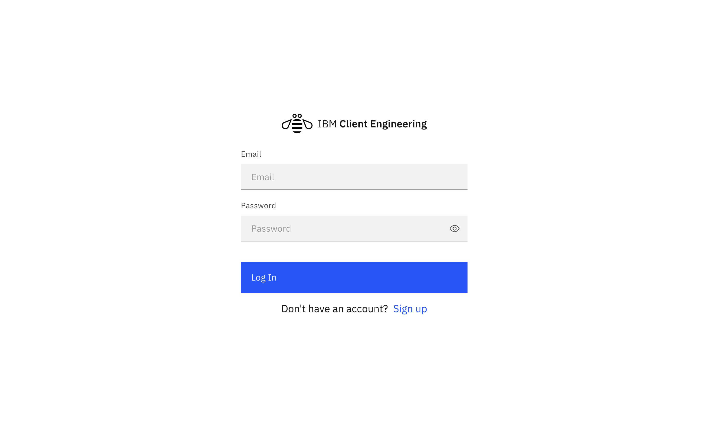
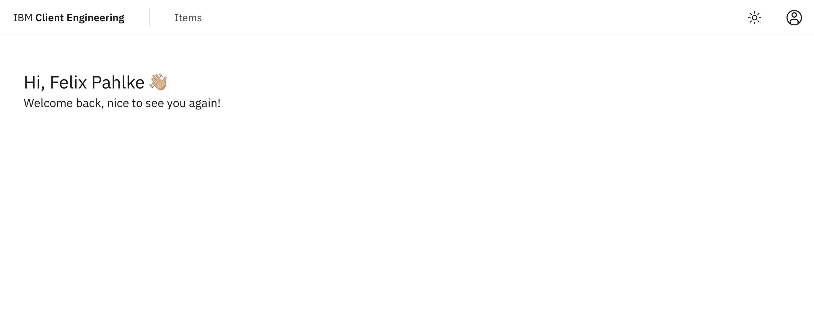
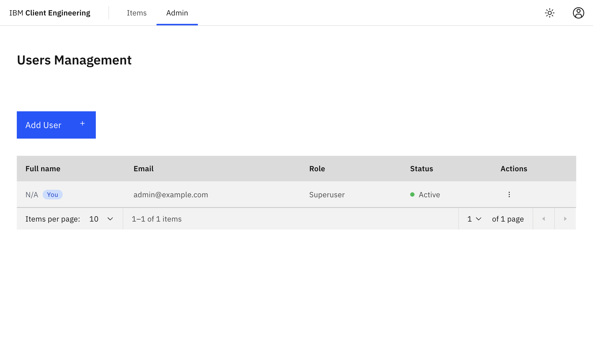
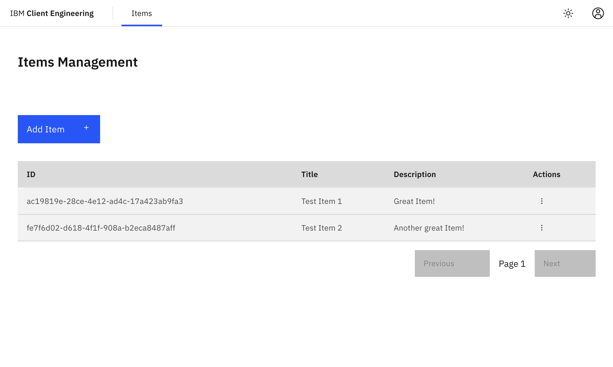
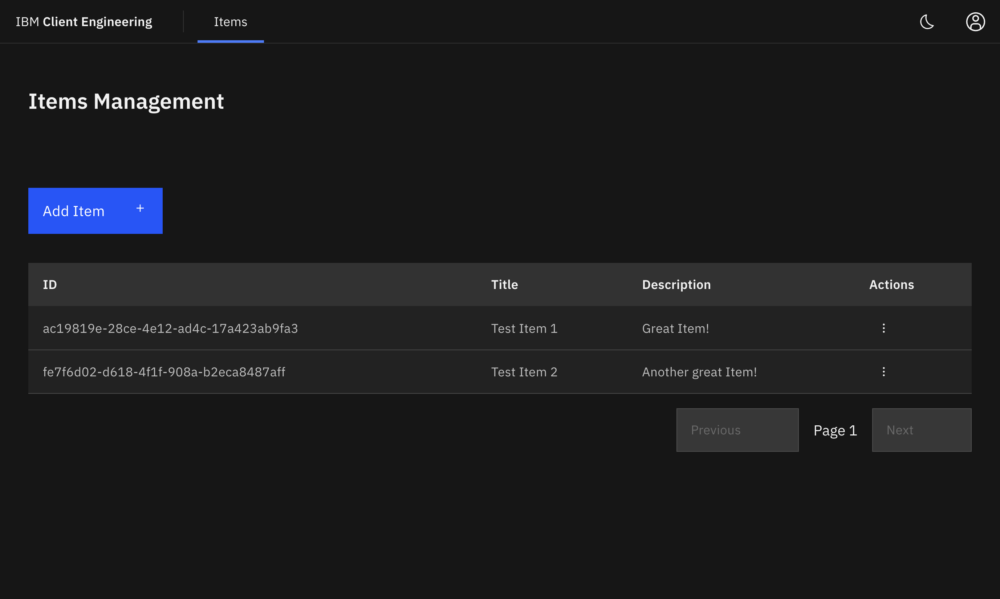

# Full Stack Client Engineering Template

## Technology Stack and Features

- ⚡ [**FastAPI**](https://fastapi.tiangolo.com) for the Python backend API.
  - 🧰 [SQLModel](https://sqlmodel.tiangolo.com) for the Python SQL database interactions (ORM).
  - 🔍 [Pydantic](https://docs.pydantic.dev), used by FastAPI, for the data validation and settings management.
  - 💾 [PostgreSQL](https://www.postgresql.org) as the SQL database.
- 🚀 [React](https://react.dev) for the frontend.
  - 💃 Using TypeScript, hooks, Vite, and other parts of a modern frontend stack.
  - 🎨 [Carbon](https://carbondesignsystem.com/) & [Carboncn UI](https://www.carboncn.dev/) (optionally) for the frontend components.
  - 🤖 An automatically generated frontend client.
  - 🦇 Dark mode support.
- 🐋 [Docker Compose](https://www.docker.com) & [colima](https://github.com/abiosoft/colima/) for development.
- 🔒 Authentication via OAuth proxy with IdP (e.g. AppID) or in-app user management.
- 🚢 Deployment instructions using OpenShift.

_This Template is based on [full-stack-fastapi-template](https://github.com/fastapi/full-stack-fastapi-template)_

## Sample Applications & Tutorials

Check out our Collection of Sample Applications (AI-Chat, Agents, RAG, etc.) built on top of the template:

- [Client Engineering DACH 🚀](https://github.ibm.com/client-engineering-dach/)
- [Tutorials](https://github.ibm.com/client-engineering-dach/full-stack-cen-template-tutorials)

## Flavours

This template is available in different flavours, which are represented by different branches, make sure to pull the correct branch for your use case:

| Branch                  | Auth                   | UI        | Pros             | Cons               |
| ----------------------- | ---------------------- | --------- | ---------------- | ------------------ |
| `oauth-proxy`           | OAuth proxy with IdP   | Carbon    | prod-friendly    | Needs AppID        |
| `oauth-proxy-custom-ui` | OAuth proxy with IdP   | shadcn/ui | prod-friendly    | Needs AppID        |
| `local-auth`            | In‑app user management | Carbon    | easy to start up | less prod-friendly |
| `local-auth-custom-ui`  | In‑app user management | shadcn/ui | easy to start up | less prod-friendly |
| `backend-only`          | API Key                | —         |
| `backend-only-no-db`    | API Key                | —         |

<br />

> The custom-ui flavours are easily adaptable to look like any customers UI, so choose those if Carbon is not the right fit.

> Prefer the `oauth-proxy` flavours, unless you have a specific reason to not use it.

> **NOTE:** The `main` branch has been renamed to `local-auth` and `oauth-proxy` is the new default branch.

## Screenshots

### Login



### Dashboard



### Admin



### Items



### Dark Mode



### Interactive API Documentation


### How to Use It

#### Setup with [create-cen-app](https://github.com/felixpahlke/create-cen-app) and choose "full-stack-cen-template"

```bash
npm create cen-app@latest
```

#### Or clone manually (commands may vary by flavour - check the specific branch):

- Clone this repository manually, set the name with the name of the project you want to use, for example `my-full-stack`:

```bash
git clone -b local-auth git@github.ibm.com:client-engineering-dach/full-stack-cen-template.git my-full-stack
```

- Enter into the new directory:

```bash
cd my-full-stack
```

- Set the new origin to your new repository (copy from GitHub interface):

```bash
git remote set-url origin git@github.ibm.com:my-username/my-full-stack.git
```

- Add the template repository as upstream to get future updates:

```bash
git remote add upstream git@github.ibm.com:client-engineering-dach/full-stack-cen-template.git
```

- Rename branch to main:

```bash
git branch -m main
```

- Push the code to your new repository:

```bash
git push -u origin main
```

### Update From the Original Template

After cloning the repository, and after doing changes, you might want to get the latest changes from this original template.

- Make sure you added the original repository as a remote, you can check it with:

```bash
git remote -v

origin    git@github.ibm.com:my-username/my-full-stack.git (fetch)
origin    git@github.ibm.com:my-username/my-full-stack.git (push)
upstream    git@github.ibm.com:client-engineering-dach/full-stack-cen-template.git (fetch)
upstream    git@github.ibm.com:client-engineering-dach/full-stack-cen-template.git (push)
```

- Pull the latest changes without merging (commands may vary by flavour - check the specific branch):

```bash
git pull --no-commit upstream local-auth
```

This will download the latest changes from this template without committing them, that way you can check everything is right before committing.

- If there are conflicts, solve them in your editor.

- Once you are done, commit the changes:

```bash
git merge --continue
```

## Development

General development docs: [development.md](./.docs/development.md).

## Deployment

OpenShift Deployment docs: [oc-deployment.md](./.docs/oc-deployment.md).

Code Engine Deployment docs: [ce-deployment.md](./.docs/ce-deployment.md).

## Backend Development

Backend docs: [backend/README.md](./backend/README.md).

## Frontend Development

Frontend docs: [frontend/README.md](./frontend/README.md).

## Release Notes

Check the file [release-notes.md](./.docs/release-notes.md).
