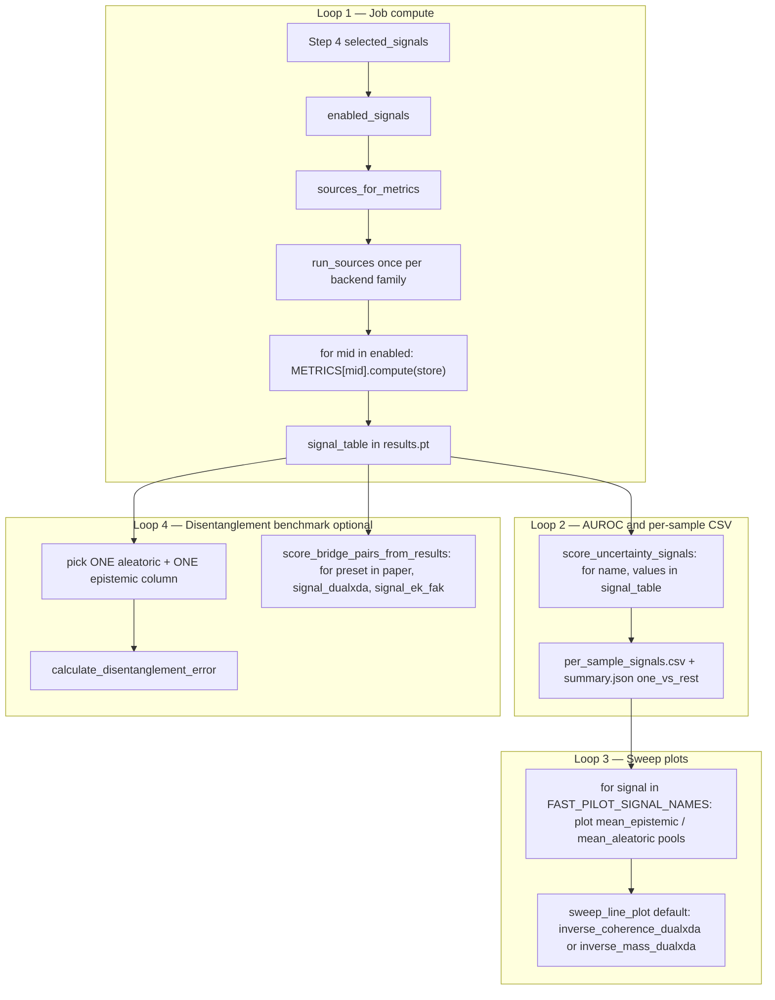
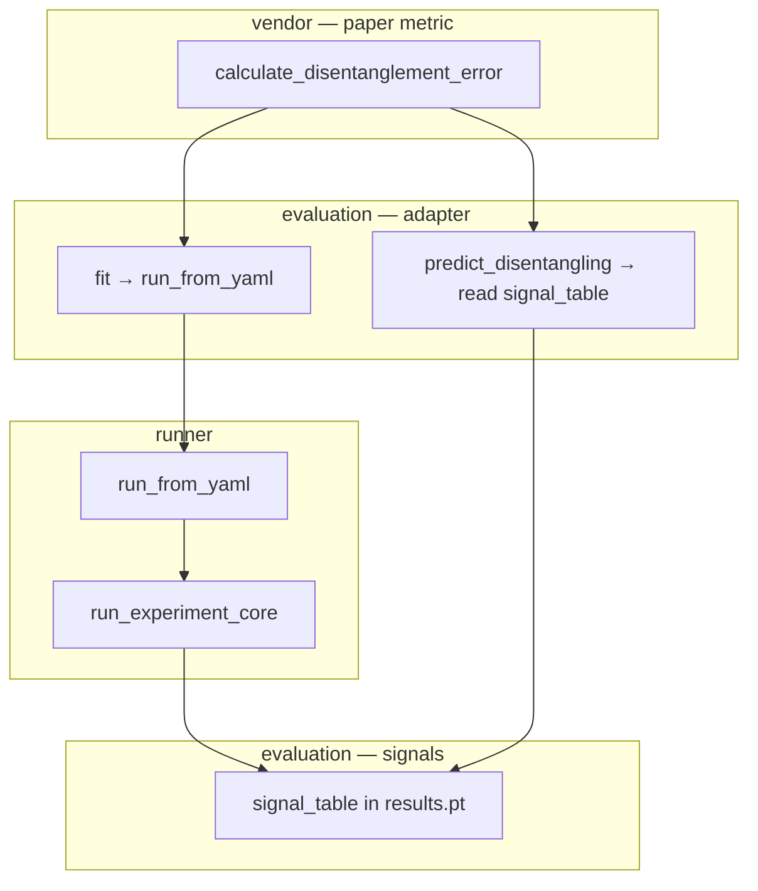

# UQLab flow (read this first)

Single map for experiments, uncertainty, and the paper disentanglement benchmark.

**Detail elsewhere (only when needed):** [signal plug-ins](features/signal-registry.md) · [benchmark launch](features/disentanglement-benchmark.md) · [wizard → YAML](features/workflow-config.md)

---

## Your notebook vs UQLab

```text
YOUR KERAS NOTEBOOK                    UQLAB (disentanglement CLI)
─────────────────────                ─────────────────────────────
calculate_disentanglement_error      calculate_disentanglement_error   ← same vendor
  └ fit → train CNN in RAM             └ fit → run_from_yaml → train+eval → results.pt
  └ predict → MC samples + entropy()   └ predict → read signal_table from results.pt
```

The **user-facing API is the same**; internals differ because UQLab reuses the full fast-pilot stack (CIFAR-10N, eval packs, optional DualXDA) instead of a tiny in-process CNN.

---

## Why `fit` and `predict_disentangling` exist

**We did not invent this split for MC dropout.** The vendored paper metric ([`DisentanglingModel`](../../src/uqlab/vendor/disentanglement_error/disentangling_model.py)) requires:

```python
model.fit(x_train, y_train, **sweep_ctx)   # one training condition per sweep point
pred, alea, epi = model.predict_disentangling(x_test)  # vectors for correlation with accuracy
```

The vendor loops ([`label_noise.py`](../../src/uqlab/vendor/disentanglement_error/label_noise.py), [`decreasing_dataset.py`](../../src/uqlab/vendor/disentanglement_error/decreasing_dataset.py)) call those two methods at each grid point, then correlate `aleatorics` with accuracy on the noise sweep and `epistemics` with accuracy on the dataset-size sweep.

| Method | Your Keras demo | UQLab adapter |
|--------|-----------------|---------------|
| **`fit`** | Train CNN 5 epochs in RAM | Run **one full experiment job** (`run_from_yaml`) for this sweep point (train + eval + write artifacts). Ignores `x, y` — CIFAR-10N loaded inside runner. |
| **`predict_disentangling`** | Run **25 MC forward passes now**, compute entropy/MI on stacked softmax | **Does not run inference.** Reads **`signal_table`** from the last job. **Paper** columns need MC during the job; **DualXDA** / **EK-FAC** columns need the matching attribution backend during the job. |

### `predict_disentangling` runtime requirements

``predict_disentangling`` is always a **read** of ``results.pt``. What the job must have computed first depends on the bridge pair ([`shared/config/signals.py`](../src/uqlab/shared/config/signals.py)):

| Bridge | Aleatoric column | Epistemic column | Job must run |
|--------|------------------|------------------|--------------|
| **Paper** (default) | `expected_entropy` | `mutual_info` | **MC dropout** (`dropout > 0`, `mc_passes > 0`) |
| **Signal · DualXDA** (`signal` / `signal_dualxda`) | `inverse_coherence_dualxda` | `inverse_mass_dualxda` | **DualXDA** (`attribution_dualxda`) |
| **Signal · EK-FAC** (`signal_ek_fak`) | `inverse_coherence_ek_fak` | `inverse_mass_ek_fak` | **Kronfluence EK-FAC** (`attribution_ek_fak`) |

Legacy column ids (`inverse_coherence`, `inverse_mass`) alias to the DualXDA suffixed metrics.

### Three signal lineages (one job, many columns)

| Lineage | Source | Example columns |
|---------|--------|-----------------|
| **Information-theoretic** | `mc_dropout` | `expected_entropy`, `mutual_info` |
| **DualXDA** | `attribution_dualxda` | `inverse_coherence_dualxda`, `inverse_mass_dualxda` |
| **EK-FAC / Kronfluence** | `attribution_ek_fak` | `inverse_coherence_ek_fak`, `inverse_mass_ek_fak` |

**EK-FAK** names the metrics pipeline (sources → primitives → metrics), not a DA method. DA backends are **DualXDA** vs **EK-FAC**. Paper metrics are information-theoretic from MC dropout.

So in UQLab:

- **MC dropout + entropy/MI happen during `fit`** (inside `run_experiment_core` → `evaluation/signals/` → `signal_table` in `results.pt`).
- **`predict_disentangling` is a rename for “return the uncertainty vectors the paper metric needs”** — a file read + column pick, not a second inference pass.

If we renamed things for honesty: `fit` ≈ `run_experiment_at_sweep_point`, `predict_disentangling` ≈ `load_disentangling_vectors_from_artifacts`. We keep the vendor names so `calculate_disentanglement_error` stays unchanged.

### Call chain (files)

```text
vendor: calculate_disentanglement_error
  └ model.fit(…, label_noise=0.3)
       evaluation/benchmarks/disentangling/fast_pilot.py
         └ build_run_yaml → runner/run_from_yaml
              uqlab/runner/experiment_core.py  (train + MC eval)
              → results.pt { signal_table, predictions }
  └ model.predict_disentangling(x_test)   # x_test ignored
       └ evaluation/artifacts.py       EvalRunArtifacts.disentangling_vectors
```

---

## Three boxes (who owns what)

| Box | Folder | Owns |
|-----|--------|------|
| **Train** | [`models/`](../src/uqlab/models/) | Architectures, training loops, MC **forward** primitives |
| **Run** | [`runner/`](../src/uqlab/runner/) | `run_from_yaml` — load YAML, validate, execute once |
| **Evaluate** | [`evaluation/`](../src/uqlab/evaluation/) | **`signal_table`**, [`artifacts.py`](../src/uqlab/evaluation/artifacts.py), METRICS, bridge, plots |
| **Vendor** | [`vendor/`](../src/uqlab/vendor/) | Frozen paper loops + ABC only — no `signal_table` schema |

`signal_table` is **evaluation data**: per-sample tensors keyed by signal name, built in [`evaluation/signals/`](../src/uqlab/evaluation/signals/) and stored in `results.pt`.

**Read contract:** [`evaluation/artifacts.py`](../src/uqlab/evaluation/artifacts.py) — `EvalRunArtifacts.from_results_pt(path)` and `.disentangling_vectors(aleatoric_signal=, epistemic_signal=)` (what vendor `predict_disentangling` returns).

---

## Glossary

| Term | Meaning |
|------|---------|
| **workflow** | Streamlit session dict (Steps 1–5); [`workflow_defaults.py`](../src/uqlab_orchestrator/config/workflow_defaults.py) |
| **RunSpec** | `build_run_yaml(workflow)` → validated nested config / `config.yaml` |
| **Runner** | [`run_from_yaml`](../src/uqlab/runner/execute.py) — single execution entry |
| **Pipeline** | Overloaded: runner stages **or** [`evaluation/pipeline/`](../src/uqlab/evaluation/pipeline/) (plots, campaign) |
| **Vendor port** | Class implementing vendor `DisentanglingModel` — [`fast_pilot.py`](../src/uqlab/evaluation/benchmarks/disentangling/fast_pilot.py) |
| **signal_table** | `dict[str, Tensor]` in `results.pt` — all enabled uncertainty metrics per eval sample |

### Experiment layers (not always 5)

| Path | Chain |
|------|--------|
| CLI | `config.yaml` → `run_from_yaml` → `results/` |
| Teach this | **Config → RunSpec → Runner → Results** |
| Streamlit + API | **Config → RunSpec → Launch → Runner → Results** (+ job infra: DB/async only) |

### Layering (dependency rule)

- **Engine** lives in [`uqlab/runner/experiment_core.py`](../src/uqlab/runner/experiment_core.py) (`run_experiment_core`).
- **Runner** ([`execute.py`](../src/uqlab/runner/execute.py)) loads YAML, validates, tees `experiment.log`, calls the engine.
- **Scripts** ([`scripts/runners/run_fast_uncertainty_classification.py`](../../scripts/runners/run_fast_uncertainty_classification.py)) are thin CLIs → `run_from_yaml` only.
- **Backend** (`TrainingOrchestrator` + `DirectExecutor`) is job infrastructure (DI, DB, WebSocket) — **not** a separate ML stage. It injects and calls `run_from_yaml`.

| Layer | ML logic? |
|-------|-----------|
| Config / RunSpec | Validation only |
| Launch (`experiment_launcher`) | HTTP transport only |
| Job infra (orchestrator + executor) | Persistence + async wrapper |
| **Runner + experiment_core** | **Yes — single ML job** |

Dependencies flow **`scripts → uqlab`**, never `uqlab → scripts`.

#### Signal metadata vs compute (light / heavy split)

| Module | Role | Imported by |
|--------|------|-------------|
| [`signals/catalog.py`](../src/uqlab/evaluation/signals/catalog.py) | `MetricMeta`, Step 4 groups, aliases — **no torch** | `shared.config.signals`, orchestrator facades, UI |
| [`signals/registry.py`](../src/uqlab/evaluation/signals/registry.py) | `MetricEntry` + `compute`, `build_signal_table` — **torch** | Runner, `runner.phases.eval` |

#### UI facade boundary

| Layer | Package | Torch at import? |
|-------|---------|------------------|
| Workflow steps | `uqlab/ui_components/workflow/` | **No** — lazy package init; Step 5 lazy-loads launch + thesis panels |
| Facades | `uqlab_orchestrator/signal_facade.py`, `dataset_facade.py` | **No** |
| ML core | `uqlab/evaluation/signals/registry.py`, `runner/` | Yes (when explicitly imported) |

Rule: workflow steps import **`uqlab_orchestrator.*`** and **`uqlab.ui_components.*`** only (`runtime_paths` allowlisted). Enforced by `tests/test_ui_import_is_light.py`.

### Where does the runner live? (uqlab, not Streamlit)

**Keep the runner at `uqlab` level.** It is ML execution — same layer as `models/` and `evaluation/`, not UI.

| Layer | Package | Calls `run_from_yaml`? |
|-------|---------|------------------------|
| **Runner (canonical)** | [`uqlab/runner/`](../src/uqlab/runner/) | **Defines** `run` / `run_config` |
| **Backend** | `backend/.../direct_executor.py` | Yes — in-process worker for API jobs |
| **CLI / scripts** | `scripts/run_fast_uncertainty_classification.py` (CLI → `run_from_yaml`) | Yes |
| **Flask wizard** | `uqlab-flask/executor.py` | Yes (local, no API) |
| **Orchestrator** | `uqlab_orchestrator/experiment_launcher.py` | **No** — HTTP create/start only |
| **Streamlit UI** | `uqlab/ui_components/` | **No** (except `read_experiment_log` for failed-run debug) |

```text
Streamlit  →  experiment_launcher  →  POST /api/v1/experiments  →  TrainingOrchestrator
                                                                      → DirectExecutor
                                                                      → uqlab.runner.run_from_yaml
```

**Do not** move the runner into `ui_components/` or teach Streamlit widgets to import `run_from_yaml` for training. That duplicates the backend path and breaks long-run async (DB status, WebSocket progress).

**Do** document the runner in [`uqlab/runner/README.md`](../src/uqlab/runner/README.md) and this file; Streamlit docs only need: “launch via orchestrator → API → runner on backend.”

Optional local dev without API: run `run_from_yaml` from CLI or Flask — still `uqlab.runner`, not Streamlit.

---

## Evaluation loops (one job, many consumers)

There is **one training job** per sweep point. Everything below reads or extends the same ``results.pt`` / ``signal_table``.



| Loop | Code | Iterates over | Output |
|------|------|---------------|--------|
| **1. Job compute** | ``collect_uncertainty_signals`` | Enabled metric ids → required sources (DualXDA / EK-FAC inferred from metrics, not a separate default) | ``signal_table`` columns |
| **2. AUROC** | ``score_uncertainty_signals`` → ``_auroc_per_signal`` | **Every** column in ``signal_table`` | ``summary.json`` one-vs-rest, ``per_sample_signals.csv`` |
| **3. Plots** | ``sweep_line_plot``, heatmaps, hypothesis validation | **Every** plottable signal in ``FAST_PILOT_SIGNAL_NAMES`` (registry ids, includes ``*_dualxda`` and ``*_ek_fak`` when computed) | One trace per signal × eval pool |
| **4. Bridge** | ``predict_disentangling`` or ``score_bridge_pairs_from_results`` | **One pair** per vendor call (Keras API); campaign helper loops presets on the same ``results.pt`` | Scalar disentanglement score per pair |

**Step 4 UI** writes ``evaluation_config.selected_signals`` → ``build_run_yaml`` → ``evaluation.signals``. That list drives loop 1 only. Plots (loop 3) automatically pick up any column present in artifacts. The disentanglement benchmark (loop 4) is separate: it does not re-run training; use ``score_bridge_pairs_from_results`` to compare paper vs DualXDA vs EK-FAC bridge pairs on one run.

Canonical default signal checklist (no EK-FAC unless checked): ``DEFAULT_SELECTED_SIGNALS`` in [`shared/config/signals.py`](../src/uqlab/shared/config/signals.py).

---

## Three independent knobs

| Knob | Where | What |
|------|--------|------|
| **A. Compute** | Step 4 / `evaluation.signals` | Which metrics land in `signal_table` (multiselect) |
| **B. Bridge pair** | `aleatoric_signal` + `epistemic_signal` | Which two columns fill vendor `(aleatorics, epistemics)`. `predict_mode="paper"` is preset only (`expected_entropy` + `mutual_info`). |
| **C. Plots** | `sweep_line_plot` | Per **signal**, pool means on label-noise vs dataset-size sweeps (same signal, two eval pools) |

---

## Paper vs signal pairing (bridge defaults)

| Mode | `aleatoric` column | `epistemic` column |
|------|-------------------|-------------------|
| **Paper** (default) | `expected_entropy` = E[H(p)] | `mutual_info` = H(mean) − E[H] |
| **Signal · DualXDA** | `inverse_coherence_dualxda` | `inverse_mass_dualxda` |
| **Signal · EK-FAC** | `inverse_coherence_ek_fak` | `inverse_mass_ek_fak` |

Entropy math in [`evaluation/signals/mc_dropout.py`](../src/uqlab/evaluation/signals/mc_dropout.py); registry in [`registry.py`](../src/uqlab/evaluation/signals/registry.py). Paper mode needs `dropout > 0` and MC signals enabled or columns are pruned.

---

## Registries (quick)

| Registry | File | Role |
|----------|------|------|
| **METRICS** | `evaluation/signals/registry.py` | Signal id → compute fn → `signal_table` column |
| **Sources** | `evaluation/signals/sources.py` | `mc_dropout`, `attribution_dualxda`, `attribution_ek_fak`, `deterministic_forward` |
| **UNCERTAINTY_PERSPECTIVES** | `uqlab_orchestrator/uncertainty/` | Label-noise vs dataset-size sweep launch |
| **ModelRegistry** | `models/architectures.py` | `model_architecture` YAML → backbone |

Full METRICS table: [features/registries.md](features/registries.md).

---

## Artifacts (`results/`)

| File | When | Contents |
|------|------|----------|
| `experiment.log` | Whole `run_from_yaml` | stdout/stderr tee |
| `summary.json` | After eval | AUROC, config snapshot |
| `per_sample_signals.csv` | After eval | Flat signal rows |
| **`results.pt`** | After eval | **`signal_table`**, `predictions`, eval packs |

Loader: [`run_artifacts.py`](../src/uqlab/run_artifacts.py).

---

## End-to-end diagram



---

## File index

| Concern | Path |
|---------|------|
| Runner | `src/uqlab/runner/execute.py` |
| Train + eval core | `src/uqlab/runner/experiment_core.py` |
| CLI wrapper | `scripts/runners/run_fast_uncertainty_classification.py` |
| Signals / signal_table | `src/uqlab/evaluation/signals/` |
| Disentanglement adapter | `src/uqlab/evaluation/benchmarks/disentangling/` |
| Vendor metric | `src/uqlab/vendor/disentanglement_error/` |
| CLI analysis | `scripts/analysis/disentanglement_error.py` |
