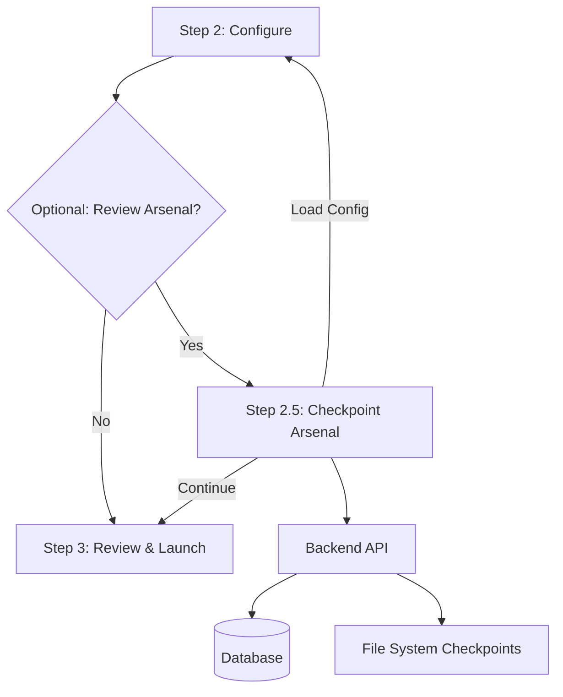

# Checkpoint Arsenal Feature - Implementation Plan

**Status:** Ready for Implementation  
**Created:** 2026-06-22  
**Feature:** Step 2.5 - Optional Checkpoint Review Before Launch

---

## Executive Summary

The Checkpoint Arsenal is an optional step in the Progressive UI workflow that allows researchers to review existing experiment checkpoints before launching new experiments. This helps avoid redundant experiments and enables informed decision-making by showing:

- **Existing checkpoints grouped by model type and date**
- **Common parameter configurations** across similar experiments
- **Configuration differences** highlighted on hover
- **Quick actions** to load existing configs or compare experiments

---

## Architecture Overview



---

## Existing Infrastructure Analysis

### ✅ Available Components to Reuse

Based on codebase analysis, we have extensive checkpoint infrastructure:

#### 1. **Checkpoint Management**
- [`checkpoint_resume.py`](uqlab-streamlit/src/uqlab/ui_components/results/checkpoint_resume.py) - Resume training from checkpoints
- [`experiment_registry.py`](uqlab-streamlit/src/uqlab/ui_components/results/experiment_registry.py) - Checkpoint path resolution, has_checkpoint()
- [`checkpoint_path()`](uqlab-streamlit/src/uqlab/ui_components/results/experiment_registry.py#L30-L32) - Get checkpoint file path
- [`build_resume_checkpoints_map()`](uqlab-streamlit/src/uqlab/ui_components/results/experiment_registry.py#L176-L193) - Map sweep points to checkpoints

#### 2. **Campaign/Sweep Grouping**
- [`campaign_groups.py`](uqlab-streamlit/src/uqlab/ui_components/grouping/campaign_groups.py) - Group experiments by timestamp/batch
- [`campaign_format.py`](uqlab-streamlit/src/uqlab/ui_components/grouping/campaign_format.py) - Format campaign labels with dates
- [`sweep_grouping.py`](uqlab-streamlit/src/uqlab/ui_components/grouping/sweep_grouping.py) - Smart grouping algorithms

#### 3. **Configuration Comparison**
- [`campaign_config_timeline.py`](uqlab-streamlit/src/uqlab/evaluation/classification/pipeline/campaign_config_timeline.py) - Config diff logic
- [`_find_config_differences()`](uqlab-streamlit/src/uqlab_orchestrator/sweep_groups.py) - Compare configs
- [`_flatten_dict()`](uqlab-streamlit/src/uqlab_orchestrator/sweep_groups.py) - Flatten nested configs for comparison

#### 4. **Experiment Selection UI**
- [`smart_experiment_selector.py`](uqlab-streamlit/src/uqlab/ui_components/selectors/smart_experiment_selector.py) - Sidebar campaign picker
- [`render_campaign_checkpoint_picker()`](uqlab-streamlit/src/uqlab/ui_components/results/checkpoint_resume.py#L74-L168) - Campaign-first checkpoint selection

#### 5. **API Integration**
- [`experiments.py`](uqlab-streamlit/backend/app/api/routes/experiments.py) - Experiment CRUD endpoints
- [`fetch_experiments()`](uqlab-streamlit/src/uqlab/ui_components/progressive/api_client.py) - Fetch from backend

---

## Implementation Plan

### Phase 1: Backend API Layer (Days 1-2)

#### Task 1.1: Create Checkpoint Arsenal API Endpoint

**File:** `backend/app/api/routes/checkpoints.py` (NEW)

```python
"""Checkpoint Arsenal API endpoints."""

from fastapi import APIRouter, Depends, Query
from sqlmodel import Session, select, func
from typing import List, Dict, Any, Optional
from datetime import datetime

from app.api.deps import SessionDep
from app.tables import UncertaintyExperiment, JobStatus

router = APIRouter()


@router.get("/arsenal")
async def get_checkpoint_arsenal(
    session: SessionDep,
    model_type: Optional[str] = Query(None, description="Filter by model type"),
    limit: int = Query(100, description="Max checkpoints to return"),
) -> Dict[str, Any]:
    """
    Get checkpoint arsenal grouped by model type and date.
    
    Returns:
        {
            "groups": [
                {
                    "model_type": "resnet18",
                    "count": 10,
                    "date_range": {"start": "2026-06-01", "end": "2026-06-20"},
                    "checkpoints": [
                        {
                            "id": "uuid",
                            "name": "exp_name",
                            "created_at": "2026-06-20T10:00:00",
                            "config": {...},
                            "metrics": {"aleatoric_auroc": 0.85, ...},
                            "has_checkpoint": true
                        }
                    ],
                    "common_params": {
                        "epochs": 12,
                        "learning_rate": 0.001,
                        "batch_size": 256
                    }
                }
            ]
        }
    """
    # Query completed experiments with checkpoints
    query = select(UncertaintyExperiment).where(
        UncertaintyExperiment.status == JobStatus.COMPLETED
    )
    
    if model_type:
        # Filter by model type in config_yaml
        query = query.where(
            UncertaintyExperiment.config_yaml.contains(f"model_type: {model_type}")
        )
    
    query = query.order_by(UncertaintyExperiment.created_at.desc()).limit(limit)
    
    experiments = session.exec(query).all()
    
    # Group by model type
    groups = _group_by_model_type(experiments)
    
    return {"groups": groups}


@router.post("/compare")
async def compare_checkpoints(
    session: SessionDep,
    checkpoint_ids: List[str],
) -> Dict[str, Any]:
    """
    Compare multiple checkpoints and return common params + differences.
    
    Args:
        checkpoint_ids: List of experiment IDs to compare
        
    Returns:
        {
            "common_params": {...},
            "differences": [
                {
                    "checkpoint_id": "uuid",
                    "params": {"epochs": 15, "dropout": 0.3}
                }
            ]
        }
    """
    # Fetch experiments
    experiments = session.exec(
        select(UncertaintyExperiment).where(
            UncertaintyExperiment.id.in_(checkpoint_ids)
        )
    ).all()
    
    if not experiments:
        return {"common_params": {}, "differences": []}
    
    # Parse configs
    configs = [_parse_config(exp.config_yaml) for exp in experiments]
    
    # Find common parameters
    common_params = _find_common_params(configs)
    
    # Find differences
    differences = []
    for exp, config in zip(experiments, configs):
        diff_params = _find_diff_params(config, common_params)
        if diff_params:
            differences.append({
                "checkpoint_id": str(exp.id),
                "name": exp.name,
                "params": diff_params
            })
    
    return {
        "common_params": common_params,
        "differences": differences
    }


def _group_by_model_type(experiments: List[UncertaintyExperiment]) -> List[Dict[str, Any]]:
    """Group experiments by model type."""
    from collections import defaultdict
    import yaml
    
    groups_dict = defaultdict(list)
    
    for exp in experiments:
        try:
            config = yaml.safe_load(exp.config_yaml)
            model_type = config.get("model", {}).get("model_type", "unknown")
            
            # Check if checkpoint exists on disk
            from pathlib import Path
            checkpoint_path = Path(f"results/experiments/{exp.id}/results/checkpoint.pt")
            has_checkpoint = checkpoint_path.exists()
            
            groups_dict[model_type].append({
                "id": str(exp.id),
                "name": exp.name,
                "created_at": exp.created_at.isoformat(),
                "config": config,
                "metrics": {
                    "aleatoric_auroc": exp.aleatoric_auroc,
                    "epistemic_auroc": exp.epistemic_auroc,
                },
                "has_checkpoint": has_checkpoint,
            })
        except Exception:
            continue
    
    # Build groups with common params
    groups = []
    for model_type, checkpoints in groups_dict.items():
        if not checkpoints:
            continue
            
        # Calculate common parameters
        configs = [c["config"] for c in checkpoints]
        common_params = _find_common_params(configs)
        
        # Date range
        dates = [datetime.fromisoformat(c["created_at"]) for c in checkpoints]
        date_range = {
            "start": min(dates).date().isoformat(),
            "end": max(dates).date().isoformat(),
        }
        
        groups.append({
            "model_type": model_type,
            "count": len(checkpoints),
            "date_range": date_range,
            "checkpoints": sorted(checkpoints, key=lambda x: x["created_at"], reverse=True),
            "common_params": common_params,
        })
    
    return sorted(groups, key=lambda x: x["count"], reverse=True)


def _parse_config(config_yaml: str) -> Dict[str, Any]:
    """Parse YAML config string."""
    import yaml
    try:
        return yaml.safe_load(config_yaml)
    except Exception:
        return {}


def _find_common_params(configs: List[Dict[str, Any]]) -> Dict[str, Any]:
    """Find parameters that are the same across all configs."""
    if not configs:
        return {}
    
    from collections import Counter
    
    # Flatten all configs
    flat_configs = [_flatten_config(c) for c in configs]
    
    # Find keys present in all configs
    all_keys = set(flat_configs[0].keys())
    for flat in flat_configs[1:]:
        all_keys &= set(flat.keys())
    
    # For each key, check if value is the same across all configs
    common = {}
    for key in all_keys:
        values = [flat[key] for flat in flat_configs]
        # Use most common value (mode)
        counter = Counter(map(str, values))
        most_common_value, count = counter.most_common(1)[0]
        
        # Consider "common" if >50% have the same value
        if count > len(configs) / 2:
            common[key] = values[0]  # Use actual value, not string
    
    return common


def _find_diff_params(config: Dict[str, Any], common_params: Dict[str, Any]) -> Dict[str, Any]:
    """Find parameters that differ from common baseline."""
    flat = _flatten_config(config)
    
    diff = {}
    for key, value in flat.items():
        if key not in common_params or common_params[key] != value:
            diff[key] = value
    
    return diff


def _flatten_config(config: Dict[str, Any], parent_key: str = "") -> Dict[str, Any]:
    """Flatten nested config dict with dot notation."""
    items = []
    for k, v in config.items():
        new_key = f"{parent_key}.{k}" if parent_key else k
        if isinstance(v, dict):
            items.extend(_flatten_config(v, new_key).items())
        else:
            items.append((new_key, v))
    return dict(items)
```

#### Task 1.2: Register Checkpoint Routes

**File:** `backend/app/api/main.py`

```python
# Add to existing imports
from app.api.routes import checkpoints

# Add to router registration
api_router.include_router(
    checkpoints.router,
    prefix="/checkpoints",
    tags=["checkpoints"]
)
```

---

### Phase 2: Frontend UI Components (Days 3-4)

#### Task 2.1: Create Checkpoint Arsenal View Component

**File:** `src/uqlab/ui_components/workflow/step2_5_checkpoint_arsenal.py` (NEW)

```python
"""Step 2.5 - Checkpoint Arsenal (optional review before launch)."""

from __future__ import annotations

from typing import Any, Callable, Dict, List, Optional
import streamlit as st
import requests
import pandas as pd
from datetime import datetime


def render_step2_5_checkpoint_arsenal(
    workflow: Dict[str, Any],
    *,
    api_base_url: str,
    get_headers: Callable[[], dict],
) -> bool:
    """
    Render Checkpoint Arsenal view.
    
    Returns:
        True if user wants to continue to Step 3, False to stay in arsenal
    """
    st.markdown("### Step 2.5: Checkpoint Arsenal 🗄️")
    st.info(
        "💡 **Review existing checkpoints** before launching. "
        "See what configurations you've already tried and avoid redundant experiments."
    )
    
    # Fetch checkpoint arsenal data
    try:
        response = requests.get(
            f"{api_base_url}/api/v1/checkpoints/arsenal",
            headers=get_headers(),
            timeout=10,
        )
        response.raise_for_status()
        arsenal_data = response.json()
    except Exception as e:
        st.error(f"Failed to load checkpoint arsenal: {e}")
        return False
    
    groups = arsenal_data.get("groups", [])
    
    if not groups:
        st.warning("No completed experiments with checkpoints found yet.")
        if st.button("Continue to Step 3", type="primary"):
            return True
        return False
    
    # Summary metrics
    total_checkpoints = sum(g["count"] for g in groups)
    model_types = len(groups)
    
    col1, col2, col3 = st.columns(3)
    with col1:
        st.metric("Total Checkpoints", total_checkpoints)
    with col2:
        st.metric("Model Types", model_types)
    with col3:
        st.metric("Groups", len(groups))
    
    st.markdown("---")
    
    # Render each model group
    for group in groups:
        _render_model_group(group, workflow, api_base_url, get_headers)
    
    st.markdown("---")
    
    # Navigation
    col1, col2 = st.columns(2)
    with col1:
        if st.button("← Back to Step 2", use_container_width=True):
            workflow["step2_complete"] = False
            st.rerun()
    with col2:
        if st.button("Continue to Step 3 →", type="primary", use_container_width=True):
            return True
    
    return False


def _render_model_group(
    group: Dict[str, Any],
    workflow: Dict[str, Any],
    api_base_url: str,
    get_headers: Callable[[], dict],
) -> None:
    """Render one model type group."""
    model_type = group["model_type"]
    count = group["count"]
    date_range = group["date_range"]
    checkpoints = group["checkpoints"]
    common_params = group["common_params"]
    
    # Group header
    with st.expander(
        f"**{model_type}** ({count} checkpoints) · {date_range['start']} to {date_range['end']}",
        expanded=False
    ):
        # Show common parameters
        st.markdown("#### Common Configuration")
        st.caption("Parameters shared across most experiments in this group:")
        
        common_df = pd.DataFrame([
            {"Parameter": k, "Value": str(v)}
            for k, v in common_params.items()
            if not k.startswith("paths.") and k not in ["seed", "experiment_name"]
        ])
        
        if not common_df.empty:
            st.dataframe(common_df, use_container_width=True, hide_index=True)
        else:
            st.caption("No common parameters found")
        
        st.markdown("#### Checkpoints")
        
        # Render checkpoint cards
        for checkpoint in checkpoints[:10]:  # Show max 10
            _render_checkpoint_card(
                checkpoint,
                common_params,
                workflow,
                api_base_url,
                get_headers
            )
        
        if len(checkpoints) > 10:
            st.caption(f"... and {len(checkpoints) - 10} more checkpoints")


def _render_checkpoint_card(
    checkpoint: Dict[str, Any],
    common_params: Dict[str, Any],
    workflow: Dict[str, Any],
    api_base_url: str,
    get_headers: Callable[[], dict],
) -> None:
    """Render individual checkpoint card with hover details."""
    exp_id = checkpoint["id"]
    name = checkpoint["name"]
    created_at = datetime.fromisoformat(checkpoint["created_at"])
    metrics = checkpoint["metrics"]
    config = checkpoint["config"]
    has_checkpoint = checkpoint["has_checkpoint"]
    
    # Calculate differences from common params
    flat_config = _flatten_config(config)
    differences = {
        k: v for k, v in flat_config.items()
        if k not in common_params or common_params.get(k) != v
    }
    
    # Card container
    with st.container():
        col1, col2, col3, col4 = st.columns([3, 2, 2, 2])
        
        with col1:
            st.markdown(f"**{name[:30]}...**" if len(name) > 30 else f"**{name}**")
            st.caption(f"ID: {exp_id[:8]}... · {created_at.strftime('%Y-%m-%d %H:%M')}")
        
        with col2:
            if metrics.get("aleatoric_auroc"):
                st.metric("Aleatoric", f"{metrics['aleatoric_auroc']:.3f}")
        
        with col3:
            if metrics.get("epistemic_auroc"):
                st.metric("Epistemic", f"{metrics['epistemic_auroc']:.3f}")
        
        with col4:
            if has_checkpoint:
                st.success("✓ Checkpoint")
            else:
                st.warning("⚠ No file")
        
        # Show differences on hover (expander)
        if differences:
            with st.expander("🔍 View differences from baseline", expanded=False):
                st.caption("Parameters that differ from the common configuration:")
                
                diff_df = pd.DataFrame([
                    {
                        "Parameter": k,
                        "Value": str(v),
                        "Common": str(common_params.get(k, "N/A"))
                    }
                    for k, v in differences.items()
                    if not k.startswith("paths.") and k not in ["seed", "experiment_name"]
                ])
                
                if not diff_df.empty:
                    st.dataframe(diff_df, use_container_width=True, hide_index=True)
                else:
                    st.caption("No significant differences")
                
                # Quick action: Load this config
                if st.button(
                    "📥 Load this configuration",
                    key=f"load_config_{exp_id}",
                    help="Pre-fill Step 2 with this experiment's configuration"
                ):
                    _load_config_to_workflow(config, workflow)
                    st.success("✅ Configuration loaded! Go back to Step 2 to review.")
        
        st.markdown("---")


def _flatten_config(config: Dict[str, Any], parent_key: str = "") -> Dict[str, Any]:
    """Flatten nested config dict."""
    items = []
    for k, v in config.items():
        new_key = f"{parent_key}.{k}" if parent_key else k
        if isinstance(v, dict):
            items.extend(_flatten_config(v, new_key).items())
        else:
            items.append((new_key, v))
    return dict(items)


def _load_config_to_workflow(config: Dict[str, Any], workflow: Dict[str, Any]) -> None:
    """Load checkpoint config into workflow."""
    # Extract relevant config sections
    model_config = config.get("model", {})
    training_config = config.get("training", {})
    data_config = config.get("data", {})
    evaluation_config = config.get("evaluation", {})
    
    # Update workflow
    workflow["training_config"] = {
        "use_checkpoint": False,
        "model_architecture": model_config.get("model_type", "resnet18"),
        "hidden_dim": model_config.get("hidden_dim", 256),
        "dropout": model_config.get("dropout", 0.2),
        "epochs": training_config.get("epochs", 12),
        "learning_rate": training_config.get("learning_rate", 0.001),
        "batch_size": training_config.get("batch_size", 256),
    }
    
    # Update data config if present
    if data_config:
        workflow["dataset_config"] = {
            "dataset_name": data_config.get("dataset_name", "cifar10n"),
            "noise_type": data_config.get("noise_type", "worse_label"),
            "under_supported": data_config.get("under_supported", "random:2"),
            "under_train_per_class": data_config.get("under_train_per_class", 50),
            "regular_train_per_class": data_config.get("regular_train_per_class", 300),
        }
    
    # Update evaluation config if present
    if evaluation_config:
        workflow["evaluation_config"] = {
            "mc_passes": evaluation_config.get("mc_passes", 20),
            "eval_per_group": evaluation_config.get("eval_per_group", 100),
        }
```

#### Task 2.2: Integrate into Progressive Workflow

**File:** `src/uqlab/ui_components/workflow/__init__.py`

```python
# Add to existing imports
from .step2_5_checkpoint_arsenal import render_step2_5_checkpoint_arsenal

# Add to __all__
__all__ = [
    # ... existing exports
    "render_step2_5_checkpoint_arsenal",
]
```

**File:** `streamlit_app_progressive.py`

Update the workflow to include Step 2.5:

```python
# After Step 2 (around line 200-220)
elif workflow["step2_complete"]:
    # Show Step 2 as complete
    st.markdown('<div class="step-complete">', unsafe_allow_html=True)
    st.markdown("### ✓ Step 2: Training Configuration")
    # ... existing summary
    st.markdown('</div>', unsafe_allow_html=True)
    
    # NEW: Optional Step 2.5 - Checkpoint Arsenal
    if not workflow.get("step2_5_skipped", False):
        st.markdown('<div class="step-active">', unsafe_allow_html=True)
        from uqlab.ui_components.workflow import render_step2_5_checkpoint_arsenal
        
        should_continue = render_step2_5_checkpoint_arsenal(
            workflow,
            api_base_url=API_BASE_URL,
            get_headers=get_headers,
        )
        
        if should_continue:
            workflow["step2_5_skipped"] = True
            st.rerun()
        
        st.markdown('</div>', unsafe_allow_html=True)
        return  # Stop here until user continues
    
    # Continue with Step 3...
```

---

### Phase 3: Testing & Refinement (Day 5)

#### Task 3.1: Unit Tests

**File:** `tests/unit/api/test_checkpoints.py` (NEW)

```python
"""Tests for checkpoint arsenal API."""

import pytest
from fastapi.testclient import TestClient
from app.main import app

client = TestClient(app)


def test_get_checkpoint_arsenal_empty():
    """Test arsenal with no experiments."""
    response = client.get("/api/v1/checkpoints/arsenal")
    assert response.status_code == 200
    data = response.json()
    assert "groups" in data
    assert isinstance(data["groups"], list)


def test_get_checkpoint_arsenal_with_filter():
    """Test arsenal with model type filter."""
    response = client.get("/api/v1/checkpoints/arsenal?model_type=resnet18")
    assert response.status_code == 200
    data = response.json()
    assert "groups" in data


def test_compare_checkpoints():
    """Test checkpoint comparison."""
    # Create test experiments first
    # ... setup code
    
    response = client.post(
        "/api/v1/checkpoints/compare",
        json={"checkpoint_ids": ["id1", "id2"]}
    )
    assert response.status_code == 200
    data = response.json()
    assert "common_params" in data
    assert "differences" in data
```

#### Task 3.2: Integration Tests

**File:** `tests/integration/test_checkpoint_arsenal_workflow.py` (NEW)

```python
"""Integration tests for checkpoint arsenal in workflow."""

import pytest
import streamlit as st
from unittest.mock import Mock, patch


def test_arsenal_view_renders():
    """Test that arsenal view renders without errors."""
    # Mock API response
    mock_response = {
        "groups": [
            {
                "model_type": "resnet18",
                "count": 5,
                "date_range": {"start": "2026-06-01", "end": "2026-06-20"},
                "checkpoints": [],
                "common_params": {"epochs": 12}
            }
        ]
    }
    
    with patch("requests.get") as mock_get:
        mock_get.return_value.json.return_value = mock_response
        mock_get.return_value.status_code = 200
        
        # Test rendering
        # ... test code


def test_load_config_from_checkpoint():
    """Test loading config from checkpoint into workflow."""
    workflow = {}
    config = {
        "model": {"model_type": "resnet18", "hidden_dim": 256},
        "training": {"epochs": 12, "learning_rate": 0.001}
    }
    
    from uqlab.ui_components.workflow.step2_5_checkpoint_arsenal import _load_config_to_workflow
    
    _load_config_to_workflow(config, workflow)
    
    assert workflow["training_config"]["model_architecture"] == "resnet18"
    assert workflow["training_config"]["epochs"] == 12
```

---

### Phase 4: Documentation (Day 6)

#### Task 4.1: User Documentation

**File:** `docs/features/checkpoint_arsenal.md` (NEW)

```markdown
# Checkpoint Arsenal

## Overview

The Checkpoint Arsenal is an optional step in the experiment workflow that helps you review existing checkpoints before launching new experiments.

## When to Use

- Before starting a new experiment campaign
- When you want to avoid redundant experiments
- To find similar past experiments and their results
- To load a previous configuration as a starting point

## Features

### 1. Grouped View by Model Type

Checkpoints are automatically grouped by model architecture (ResNet18, ResNet50, DINOv2, etc.) with:
- Total checkpoint count per model
- Date range of experiments
- Common configuration parameters

### 2. Configuration Comparison

For each model group, the arsenal shows:
- **Common Parameters**: Values that are the same across most experiments
- **Differences**: Parameters that vary between experiments (shown on hover)

### 3. Quick Actions

- **Load Configuration**: Pre-fill Step 2 with a checkpoint's configuration
- **View Differences**: See how each checkpoint differs from the baseline
- **Compare Multiple**: Select multiple checkpoints for side-by-side comparison

## Usage

1. Complete Step 2 (Training Configuration)
2. Step 2.5 (Checkpoint Arsenal) appears automatically
3. Review existing checkpoints grouped by model type
4. Optionally load a configuration or continue to Step 3

## Tips

- Use the arsenal to avoid running duplicate experiments
- Check the date range to see recent vs. old experiments
- Look for checkpoints with similar configurations but different results
- Load a successful configuration as a starting point for variations
```

#### Task 4.2: Developer Documentation

**File:** `docs/development/checkpoint_arsenal_architecture.md` (NEW)

```markdown
# Checkpoint Arsenal - Architecture

## Component Overview

```
┌─────────────────────────────────────────────────────────────┐
│                    Streamlit UI (Step 2.5)                   │
│  src/uqlab/ui_components/workflow/step2_5_checkpoint_arsenal.py │
└─────────────────────────────────────────────────────────────┘
                               │
                               ▼
┌─────────────────────────────────────────────────────────────┐
│                    Backend API                               │
│  backend/app/api/routes/checkpoints.py                       │
│                                                              │
│  GET  /api/v1/checkpoints/arsenal                           │
│  POST /api/v1/checkpoints/compare                           │
└─────────────────────────────────────────────────────────────┘
                               │
                               ▼
┌─────────────────────────────────────────────────────────────┐
│                    Database + File System                    │
│  - UncertaintyExperiment table                              │
│  - results/experiments/{id}/results/checkpoint.pt           │
└─────────────────────────────────────────────────────────────┘
```

## Reused Components

### From Checkpoint Resume
- `checkpoint_path()` - Resolve checkpoint file paths
- `has_checkpoint()` - Check if checkpoint exists
- `build_resume_checkpoints_map()` - Map sweep points to checkpoints

### From Campaign Grouping
- `group_experiments_for_results()` - Group by timestamp/batch
- `campaign_date_label()` - Format dates
- `representative_experiment_id()` - Get short ID

### From Config Comparison
- `_find_config_differences()` - Compare two configs
- `_flatten_dict()` - Flatten nested configs

## API Design

### GET /api/v1/checkpoints/arsenal

Returns experiments grouped by model type with common parameters.

**Query Parameters:**
- `model_type` (optional): Filter by model architecture
- `limit` (optional): Max checkpoints to return (default: 100)

**Response:**
```json
{
  "groups": [
    {
      "model_type": "resnet18",
      "count": 10,
      "date_range": {
        "start": "2026-06-01",
        "end": "2026-06-20"
      },
      "checkpoints": [...],
      "common_params": {
        "epochs": 12,
        "learning_rate": 0.001
      }
    }
  ]
}
```

### POST /api/v1/checkpoints/compare

Compare multiple checkpoints and return differences.

**Request Body:**
```json
{
  "checkpoint_ids": ["uuid1", "uuid2", "uuid3"]
}
```

**Response:**
```json
{
  "common_params": {
    "epochs": 12,
    "batch_size": 256
  },
  "differences": [
    {
      "checkpoint_id": "uuid1",
      "name": "exp_name",
      "params": {
        "dropout": 0.2,
        "learning_rate": 0.001
      }
    }
  ]
}
```

## Performance Considerations

- Cache common parameters calculation (expensive for large groups)
- Limit checkpoint file system checks (use database flags)
- Paginate large checkpoint lists
- Index database queries on model_type and created_at
```

---

## Success Criteria

### Functional Requirements

✅ **Must Have:**
1. Arsenal view displays existing checkpoints grouped by model type
2. Common parameters calculated and displayed for each group
3. Hover shows configuration differences from baseline
4. "Load this config" action pre-fills Step 2
5. Integration with Progressive UI workflow (Step 2.5)
6. Backend API endpoints functional

✅ **Should Have:**
7. Date range filtering
8. Model type filtering
9. Performance metrics displayed (AUROC scores)
10. Checkpoint file existence validation

✅ **Nice to Have:**
11. Side-by-side comparison of multiple checkpoints
12. Export checkpoint group as CSV
13. Search/filter within groups
14. Color-coded performance indicators

### Non-Functional Requirements

- **Performance:** Arsenal loads in <2 seconds for 100 checkpoints
- **Usability:** Clear visual hierarchy, intuitive navigation
- **Reliability:** Graceful handling of missing checkpoints
- **Maintainability:** Reuses existing components, follows project patterns

---

## Implementation Timeline

| Phase | Tasks | Duration | Dependencies |
|-------|-------|----------|--------------|
| **Phase 1** | Backend API endpoints | 2 days | Database schema |
| **Phase 2** | Frontend UI components | 2 days | Phase 1 complete |
| **Phase 3** | Testing & refinement | 1 day | Phase 2 complete |
| **Phase 4** | Documentation | 1 day | Phase 3 complete |

**Total Estimated Time:** 6 days

---

## Risk Mitigation

### Risk 1: Performance with Large Checkpoint Lists

**Mitigation:**
- Implement pagination (show 10-20 per group)
- Cache common parameter calculations
- Use database indexes for queries
- Lazy load checkpoint file checks

### Risk 2: Configuration Comparison Complexity

**Mitigation:**
- Reuse existing `_find_config_differences()` logic
- Focus on key parameters (exclude paths, seeds)
- Use simple string comparison for most values
- Handle nested configs with flattening

### Risk 3: UI Complexity

**Mitigation:**
- Keep initial version simple (expandable groups)
- Use existing Streamlit components
- Follow Progressive UI patterns
- Iterate based on user feedback

---

## Future Enhancements

### Phase 2 Features (Post-MVP)

1. **Advanced Filtering**
   - Filter by date range
   - Filter by performance metrics
   - Filter by configuration parameters

2. **Comparison Matrix**
   - Side-by-side comparison of 2-4 checkpoints
   - Visual diff highlighting
   - Performance comparison charts

3. **Smart Recommendations**
   - "Similar to your current config" suggestions
   - "Best performing in this group" highlights
   - "Unexplored parameter combinations" suggestions

4. **Export & Sharing**
   - Export checkpoint group as CSV
   - Share checkpoint configurations
   - Create templates from checkpoints

---

## References

- [DUAL_FACADE_ARCHITECTURE.md](DUAL_FACADE_ARCHITECTURE.md) - Backend architecture
- [PHASE_4_INTEGRATION_IMPLEMENTATION_PLAN.md](PHASE_4_INTEGRATION_IMPLEMENTATION_PLAN.md) - Integration patterns
- [checkpoint_resume.py](src/uqlab/ui_components/results/checkpoint_resume.py) - Existing checkpoint logic
- [campaign_groups.py](src/uqlab/ui_components/grouping/campaign_groups.py) - Grouping patterns

---

**Document Version:** 1.0  
**Last Updated:** 2026-06-22  
**Status:** Ready for Implementation