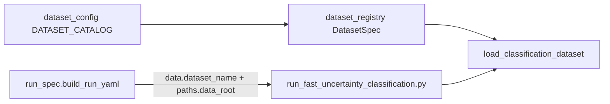

# Dataset plugin architecture

## Problem

`dataset_name` was selected in Step 1 but not persisted into experiment YAML. Training always loaded CIFAR-10N. Adding MNIST (or any dataset) requires a single registry + factory path from UI → orchestrator → training script.

## Target flow



## ClassificationDataset protocol

Every loader must expose:

| Member | Purpose |
|--------|---------|
| `num_classes` | Class count for splits and models |
| `clean_labels` | Ground-truth labels (numpy) |
| `targets` | Training labels (may be noisy) |
| `noisy_labels` | Noisy label array or None |
| `noise_mask` | Boolean mask where label != clean |
| `class_names` | Human-readable class names |
| `get_image(index)` | PIL/ndarray for end-to-end training |
| `inject_custom_noise(pct, seed)` | Synthetic Fig. 4 noise |

Implementations: `CIFAR10NDataset`, `MNISTDataset`.

## DatasetSpec registry

Registered in `uqlab.data.dataset_registry`:

- `name`, `label`, `num_classes`, `default_root`
- `supports_human_noise` (CIFAR-10N only)
- `supports_synthetic_noise` (all)
- `image_shape`, `noise_options`

## YAML contract

```yaml
data:
  dataset_name: mnist
  noise_type: clean_label
  ...
paths:
  data_root: ./data/mnist
  cifar10n_root: ./data/mnist  # backward compat alias
```

## Adding a dataset

1. Add loader implementing the protocol under `src/uqlab/data/loaders/`.
2. Register `DatasetSpec` in `dataset_registry.py`.
3. Extend `DATASET_CATALOG` via registry (orchestrator `dataset_config.py`).
4. Add `fallback_dataset_stats()` entry for offline UI.
5. No backend change required until stats API is extended separately.

## Modularity score (pre-refactor)

| Layer | Score |
|-------|-------|
| UI catalog | Partial |
| Workflow → YAML | Poor → **Fixed** via `data.dataset_name` |
| Backend stats | Partial (CIFAR-only; UI uses offline fallback for new datasets) |
| Loaders | Poor → **Factory** |
| Training script | Poor → **Factory** |
