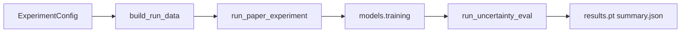

# Evaluation pipeline

**Data first:** [`data-pipeline.md`](data-pipeline.md) — `build_run_data`  
**Module README:** [`src/uqlab_core/evaluation/README.md`](../../src/uqlab_core/evaluation/README.md)

Maps YAML → train → uncertainty signals → on-disk artifacts.

## End-to-end (one run)



| Step | Entry | Module | Output |
|------|-------|--------|--------|
| Data | `build_run_data` | `uqlab_core.data.buildData` | `RunDataBundle` |
| Train + eval | `run_paper_experiment` | `uqlab_core.runner.train_eval` | model + eval summary |
| Eval only | `run_uncertainty_eval` | `uqlab_core.evaluation.pipeline` | `UncertaintyEvalResult` |

## Collect vs score (canonical split)

Implementation: [`src/uqlab_core/evaluation/pipeline.py`](../../src/uqlab_core/evaluation/pipeline.py)

| Phase | Function | Needs model? | Produces |
|-------|----------|--------------|----------|
| **Collect** | `collect_uncertainty_signals` | Yes | `signal_table`, `zwischen/00–05_*.pt`, influence matrices |
| **Score** | `score_uncertainty_signals` | No* | AUROC rows, `per_sample_signals.csv`, macro-F1 |

\*Score runs a small linear classifier on signals for macro-F1; no forward/attribution pass.

**Collect** = sources → `PrimitiveStore` (core vectors) → registry → scalars.  
**Score** = [`scoring.py`](../../src/uqlab_core/evaluation/scoring.py) on scalars only.

`uqlab.runner.phases.eval` is a thin shim re-exporting `*_core` functions — prefer `uqlab_core.evaluation.pipeline` in new code.

## Notebook shortcut

```python
from uqlab_core.runner.notebook_run import setup_notebook

ctx = setup_notebook(seed=42)
# Steps 2–5 mirror experiment_core: build_run_data → train → collect → score
```

Four-region walkthrough: [`four-region-notebook.md`](four-region-notebook.md).

## Artifacts

| File | Written by |
|------|------------|
| `zwischen/00_eval_setup.pt` | collect |
| `zwischen/01..05_*.pt`, `02_influence_*.pt` | collect |
| `per_sample_signals.csv` | score |
| `summary.json`, `results.pt` | `run_paper_experiment` persist |

## Related

- [`signals/README.md`](../../src/uqlab_core/evaluation/signals/README.md) — catalog, registry, vectors
- [`ATTRIBUTION_ARTIFACTS.md`](ATTRIBUTION_ARTIFACTS.md) — zwischen layout
- [`validation-sweeps.md`](validation-sweeps.md) — sweep → metrics path
