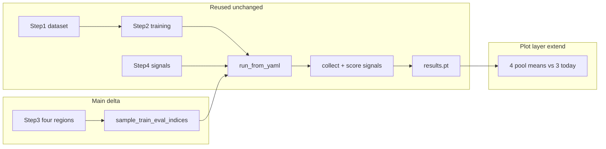

# Evaluation protocol (current vs 4-region)

**Flow →** [`docs/UQLAB_FLOW.md`](../UQLAB_FLOW.md)

Canonical summary of how fast-pilot **train / eval / scoring / plots** work today, and how a proposed **four-region CIFAR-10 partition** should work while reusing the same pipeline.

For deeper detail see:

- [`docs/signals/UNCERTAINTY_SUBSET_LOGIC.md`](../signals/UNCERTAINTY_SUBSET_LOGIC.md) — training subset + eval pool selection
- [`docs/features/disentanglement-benchmark.md`](disentanglement-benchmark.md) — paper metric vs pool-filtered sweep plots
- [`docs/features/sweep-grouping.md`](sweep-grouping.md) — campaign grouping + eval pool plot semantics
- [`docs/features/ATTRIBUTION_ARTIFACTS.md`](ATTRIBUTION_ARTIFACTS.md) — `zwischen/` influence matrices + assignment notebook/YAML mapping

Reference paper: [`src/uqlab/2408.12175v3.pdf`](../../src/uqlab/2408.12175v3.pdf)

---

## Reuse thesis

**Most of the stack stays the same.** The 4-region benchmark is not a second pipeline — it is a different **Step 3 partition spec** that compiles into the same downstream path.

| Layer | Reuse? | Notes |
|-------|--------|-------|
| Steps 1–2 (dataset, model, training) | **Yes** | Unchanged |
| **Step 3 (uncertainty / partition)** | **Different** | User picks **classes + policy per region** (noisy / sparse / clean / OOD) instead of global under-supported list + global noise % |
| Step 4 (signals, MC, attribution) | **Yes** | Same signal registry and eval config |
| Step 5 launch | **Mostly yes** | New preset for `four_region`; Fig 3/4 paper sweeps unchanged |
| `run_spec` → `config.yaml` | **Thin extension** | Compile Step 3 regions → `data.class_regions`; legacy keys still work |
| `run_from_yaml` / `experiment_core` | **Yes** | Same train → eval → persist flow |
| `collect_uncertainty_signals` / `score_uncertainty_signals` | **Yes** | Same per-sample signals + AUROC; optional 4th positive set for OOD |
| `results.pt` / `summary.json` / recovery | **Yes** | Same artifact shape; add `{signal}_mean_ood` when OOD pack exists |
| Plots | **Extend, not replace** | Same pool-mean machinery; **four pool lines** instead of two primary uncertainty regions + clean |

Conceptually, Step 3 today defines **two uncertainty knobs** (epistemic under-train + global aleatoric noise) that map to **three eval packs**. Four-region mode makes all four regimes **explicit and simultaneous** by assigning **each class 0–9 to exactly one region** with its own train/noise policy.



---

## Two benchmark modes (coexistence)

| Mode | What varies | Primary use |
|------|-------------|-------------|
| **Paper sweeps (Fig 3 / Fig 4)** | One axis per campaign: under-train **or** label-noise | Reproduce paper disentanglement curves (swept Percentage 0–1) |
| **4-region partition (proposed)** | Fixed class blocks in one run; Step 3 assigns all 10 classes | Simultaneous noisy + sparse + clean + OOD eval in **one** run |

The paper ([2408.12175v3.pdf](../../src/uqlab/2408.12175v3.pdf)) uses **swept axes + global signal means** (`expected_entropy`, `mutual_info`), not the 4-region layout. The four-region partition is an **additional** benchmark mode, not a reinterpretation of Fig 3/4.

---

## How evaluation is done today

Source of truth: [`src/uqlab/data/setup.py`](../../src/uqlab/data/setup.py), [`src/uqlab/runner/experiment_core.py`](../../src/uqlab/runner/experiment_core.py), [`src/uqlab/runner/phases/eval.py`](../../src/uqlab/runner/phases/eval.py).

### End-to-end path

```
workflow (Steps 1–5)
  → run_spec.build_run_yaml() → config.yaml
  → pipeline.run(config, output_dir)
  → sample_train_eval_indices() → SplitSpec
  → train model on train_indices
  → build three eval packs → collect_uncertainty_signals()
  → score_uncertainty_signals() → summary.json + results.pt
```

### Config knobs (`config.yaml` `data` block)

Compiled by [`run_spec.build_run_yaml`](../../src/uqlab_orchestrator/run_spec.py):

| Field | Role |
|-------|------|
| `under_supported_classes` | Classes with sparse training (typically 2 IDs) |
| `under_train_per_class` | Training samples per under-supported class (epistemic manipulation) |
| `regular_train_per_class` | Training samples per regular class |
| `aleatoric_noise_percentage` | Global synthetic noise injected before split ([`dataset_registry.load_dataset`](../../src/uqlab/data/dataset_registry.py) → `inject_custom_noise`) |
| `eval_per_group` | Cap on samples drawn per eval pack |
| `seed` | Reproducibility for split sampling |

Paper sweep defaults (from `run_spec` docstring):

- **Fig 3 / `under_train`:** vary `under_train_per_class`, `aleatoric_noise_percentage=0`
- **Fig 4 / `noise_rate`:** vary `aleatoric_noise_percentage`, fixed training budget

### Train split

[`sample_train_eval_indices`](../../src/uqlab/data/fast_pilot_loader.py) (~L92–115):

- **Under-supported classes:** first `under_train_per_class` **clean** samples per class
- **Regular classes:** first `regular_train_per_class` samples (noisy + clean mixed in index order)
- Noise is **not** applied inside the split function; it reads pre-set `dataset.noise_mask`

### Three eval packs

Same function (~L122–150). Samples must **not** appear in the training set.

| Pack | `eval_group_labels` | Code constant | Selection rule |
|------|---------------------|---------------|----------------|
| `clean` | 0 | `GROUP_CLEAN` | Regular class, **clean** label |
| `aleatoric_like` | 1 | `GROUP_ALEATORIC` | Regular class, **noisy** label |
| `epistemic_like` | 2 | `GROUP_EPISTEMIC` | Under-supported class, **clean** label |

**No OOD group exists today.** Classes 8–9 (or any class) can still appear in training if not listed as under-supported.

When `aleatoric_noise_percentage=0`, the aleatoric eval pool is empty (normal for Fig 3 runs). When training is balanced (`under_train_per_class == regular_train_per_class`), the epistemic pool is empty (normal for Fig 4 runs at 0% under-train gap).

### Runtime scoring

1. Concatenate eval packs; attach `eval_group_labels`, clean/noisy labels, dataset indices
2. **`collect_uncertainty_signals`** — DualXDA / logits / optional MC → `signal_table[name → Tensor[N]]`
3. **`score_uncertainty_signals`** — per-signal binary AUROC:
   - Aleatoric: detect noisy labels within aleatoric_like pool
   - Epistemic: detect under-trained classes within epistemic_like pool
   - Plus 3-way classifier macro-F1 on signals
4. Persist `summary.json`, `results.pt`, `per_sample_signals.csv`, optional `results/zwischen/*.pt`

Pool-filtered means in `results.pt` (for sweep diagnostic plots):

```
{signal}_mean              # all eval samples
{signal}_mean_epistemic    # epistemic_like pool only
{signal}_mean_aleatoric    # aleatoric_like pool only
{signal}_mean_clean        # clean pool only
```

See [`run_artifacts._signal_means_from_results_pt`](../../src/uqlab/run_artifacts.py).

### Two plotting semantics

| View | Y curves | When to use |
|------|----------|-------------|
| **Paper plot** ([`paper_benchmark_plot.py`](../../src/uqlab/evaluation/pipeline/paper_benchmark_plot.py)) | Accuracy + global `{expected_entropy}_mean` + `{mutual_info}_mean` vs Percentage (0–1) | Fig 3/4 campaign sweeps |
| **Pool diagnostic** ([`sweep_line_plot.py`](../../src/uqlab/evaluation/pipeline/sweep_line_plot.py)) | One signal's mean in primary eval pool (+ optional mirror) + accuracy vs swept param | Per-pool diagnostics; mirror often empty on single-arm sweeps |

Details: [`disentanglement-benchmark.md`](disentanglement-benchmark.md).

### Paper sweep campaigns

- **Fig 3 arm:** sweep `under_train_per_class`, 0% global noise → epistemic pool populated, aleatoric pool usually empty
- **Fig 4 arm:** sweep `aleatoric_noise_percentage`, fixed under-train mirror → opposite
- **Run both:** two separate 1D campaigns sharing a launch timestamp, not one combined 2D plot

---

## Proposed 4-region partition (should be done)

Advisor / target spec for CIFAR-10 classes 0–9:

| Region | Classes (example) | Train policy | Eval role | Uncertainty intent |
|--------|-------------------|--------------|-----------|-------------------|
| **Noisy** | 0–3 | Full budget; **30% labels flipped** per class | Aleatoric-like eval from noisy held-out samples | Aleatoric |
| **Sparse** | 4–5 | **10%** of class train pool only | Epistemic-like eval from held-out clean samples | Epistemic |
| **Clean** | 6–7 | Full budget; no noise | Clean baseline eval | Low uncertainty |
| **OOD** | 8–9 | **Zero train samples** | Test-only; never seen at train | Out-of-distribution |

### Differences from today

| Aspect | Today (legacy) | 4-region proposal |
|--------|----------------|-------------------|
| Class roles | 2 under-supported + 8 regular | 4 blocks; every class assigned to exactly one region |
| Noise | Global `%` over all samples | **Class-targeted** flip (e.g. 30% on noisy region only) |
| Sparsity | `under_train_per_class` (absolute count) | **Train fraction** per region (e.g. 10% on sparse region) |
| OOD | Not modeled | Withhold OOD-region classes from train entirely |
| Co-occurrence | Usually one axis swept; other pool often empty | All four regimes active in **one** run |

### Mapping regions → eval packs

Reuse existing pack semantics where possible; add one new pack for OOD:

| Region | Maps to eval pack | `eval_group_labels` |
|--------|-------------------|---------------------|
| Noisy (0–3) | `aleatoric_like` | 1 |
| Sparse (4–5) | `epistemic_like` | 2 |
| Clean (6–7) | `clean` | 0 |
| OOD (8–9) | **`ood_like` (new)** | 3 |

Today “two regions” in practice means **two uncertainty manipulations** (sparse classes + global noise) that often **do not co-occur** in paper sweeps; `clean` is a third pack but not a swept axis. Four-region mode makes all four **first-class** in Step 3 and in plots.

---

## What actually changes (thin layer)

Implementation touch points (four-region mode). Everything else reuses the existing pipeline.

| Touch point | Change | Reuses |
|-------------|--------|--------|
| **Step 3 UI** | Partition mode: 4 region cards — class multiselect per region (disjoint, cover 0–9), per-region noise % / train fraction / withhold | [`step3_uncertainty.py`](../../src/uqlab/ui_components/workflow/step3_uncertainty.py) panel patterns |
| **`run_spec.build_run_yaml`** | Compile Step 3 → `data.class_regions` + `partition_mode: four_region` | Existing YAML for model/training/evaluation |
| **Noise injection** | Per-region label flip before split | `dataset.noise_mask` contract |
| **`sample_train_eval_indices`** | Interpret `class_regions` when `partition_mode=four_region` | Same `SplitSpec` return type |
| **Group labels + artifacts** | `GROUP_OOD = 3`; `{signal}_mean_ood` in metrics | [`run_artifacts.py`](../../src/uqlab/run_artifacts.py) pool loop |
| **Scoring** | Optional OOD one-vs-rest AUROC | [`evaluation/metrics/scoring.py`](../../src/uqlab/evaluation/metrics/scoring.py) |
| **Plots** | Fixed-run dashboard: 4 pool mean traces (or 2×2 grid) | [`sweep_plot_pools.py`](../../src/uqlab/evaluation/pipeline/sweep_plot_pools.py) |

**Explicitly unchanged:** `pipeline.run`, DualXDA/MC signal collection, zwischen recovery, API, Fig 3/4 launch arms, paper benchmark sweeps.

Use **`data.partition_mode: legacy | four_region`** so Step 3 shows either legacy epistemic/aleatoric panels or the four-region editor.

---

## Step 3 UX (proposed)

### Legacy mode (today)

- Sweep target: under-train **or** label-noise **or** both **or** single point
- Under-supported class picker + `under_train_per_class` / `regular_train_per_class`
- Global custom noise slider (fixed mirror when not swept)

### Four-region mode (implemented)

Table or four expanders:

| Region | Classes (user picks) | Train | Labels |
|--------|---------------------|-------|--------|
| Noisy | e.g. 0,1,2,3 | 100% | flip 30% |
| Sparse | e.g. 4,5 | 10% | clean |
| Clean | e.g. 6,7 | 100% | clean |
| OOD | e.g. 8,9 | 0% | clean (eval only) |

**Validation:** classes disjoint; union = all 10 CIFAR-10 classes. Default preset fills the advisor example above.

---

## Example YAML (four-region)

```yaml
data:
  partition_mode: four_region
  class_regions:
    noisy:    { classes: [0,1,2,3], label_flip_pct: 30, train_fraction: 1.0 }
    sparse:   { classes: [4,5],     train_fraction: 0.10 }
    clean:    { classes: [6,7],     train_fraction: 1.0 }
    ood:      { classes: [8,9],     train_fraction: 0.0 }
  eval_per_group: 100
  seed: 42
```

Legacy paper-sweep configs continue to use `under_supported_classes`, `under_train_per_class`, and `aleatoric_noise_percentage` without `class_regions`.

---

## Related code paths

| Concern | Location |
|---------|----------|
| Split construction | [`fast_pilot_loader.sample_train_eval_indices`](../../src/uqlab/data/fast_pilot_loader.py) |
| Pool expectations for plots | [`benchmark_axes.py`](../../src/uqlab/data/benchmark_axes.py), [`sweep_plot_pools.py`](../../src/uqlab/evaluation/pipeline/sweep_plot_pools.py) |
| Eval + scoring | [`fast_pilot_eval.py`](../../src/uqlab/evaluation/pipeline/fast_pilot_eval.py) |
| Metrics from disk | [`run_artifacts.metrics_row_from_run`](../../src/uqlab/run_artifacts.py) |
| Wizard → YAML | [`run_spec.py`](../../src/uqlab_orchestrator/run_spec.py) |
| Step 3 UI | [`step3_uncertainty.py`](../../src/uqlab/ui_components/workflow/step3_uncertainty.py) |

---

## Out of scope (documentation only)

This document does **not** implement four-region split, UI, or scoring. It does not replace Fig 3/4 launch presets or migrate existing experiments.
