# Four-region partition (data layer)

**Canonical code:** [`src/uqlab_core/data/splits/four_region.py`](../../src/uqlab_core/data/splits/four_region.py)  
**Entry:** [`build_run_data`](../../src/uqlab_core/data/buildData.py) when `data.partition_mode: four_region`

Partitioning is a **data** concern. Evaluation only reads the resulting `group` labels — it does not flip labels or subsample training data.

## Assignment semantics (CIFAR-10 default)

| Region | Classes | Train policy | Simulates | `per_sample_signals.csv` group |
|--------|---------|--------------|-----------|--------------------------------|
| **Noisy** | 0–3 | Full train; **30% label flip** | Aleatoric uncertainty | `aleatoric_like` |
| **Sparse** | 4–5 | **10%** of training samples | Epistemic uncertainty | `epistemic_like` |
| **Clean** | 6–7 | Full train; no noise | Low-uncertainty baseline | `clean` |
| **OOD** | 8–9 | **Withheld** from training | Out-of-distribution at test | `ood_like` |

Preset: `DEFAULT_FOUR_REGION_PRESET` in `four_region.py`.

## Flow: YAML → split → eval groups

```mermaid
flowchart LR
  yaml[class_regions YAML] --> validate[validate_class_regions]
  validate --> noise[inject_class_label_noise on noisy]
  noise --> sample[sample_indices_for_four_region]
  sample --> packs[clean / aleatoric / epistemic / ood indices]
  packs --> materialize[step2_materialize_tensor_packs]
  materialize --> labels[eval_group_labels in data_pack]
  labels --> csv[group column in per_sample_signals.csv]
```

| Split region | `SplitSpec` field | Eval pack name |
|--------------|-------------------|----------------|
| noisy | `aleatoric_eval_indices` | aleatoric |
| sparse | `epistemic_eval_indices` | epistemic |
| clean | `clean_eval_indices` | clean |
| ood | `ood_eval_indices` | ood |

## Where metrics are computed

1. **Data layer** applies partition + noise → group labels on each eval sample.
2. **Collect** (`uqlab_core.evaluation.pipeline.collect_uncertainty_signals`) runs attribution/MC sources → `signal_table` scalars via [`signals/registry.py`](../../src/uqlab_core/evaluation/signals/registry.py).
3. **Score** (`score_uncertainty_signals`) ranks scalars (AUROC) → `per_sample_signals.csv`.
4. **Notebook Step 6** (optional) post-hoc tables via `attribution_distribution_summary` — not written to `summary.json`.

See [`four-region-notebook.md`](four-region-notebook.md) for the 6-step walkthrough.

## Sweeps vs single-run benchmark

| Use case | Orchestrator | Swept knob |
|----------|--------------|------------|
| Single assignment run | Notebook YAML / `experiment_core` | Fixed 30% flip, 10% sparse (preset) |
| Region-axis validation | [`four_region_validation.py`](../../src/uqlab/evaluation/validation/four_region_validation.py) | `label_flip_pct` or `sparse.train_fraction` |
| Legacy paper sweeps | [`validation_config.py`](../../src/uqlab_orchestrator/config/validation_config.py) | Global `aleatoric_noise_percentage` / `under_train_per_class` |

Details: [`validation-sweeps.md`](validation-sweeps.md).

## Related

- [`data-pipeline.md`](data-pipeline.md) — `build_run_data` walkthrough
- [`src/uqlab_core/data/README.md`](../../src/uqlab_core/data/README.md) — module README with mermaid
- [`evaluation-protocol.md`](evaluation-protocol.md) — how four-region reuses the same eval stack
