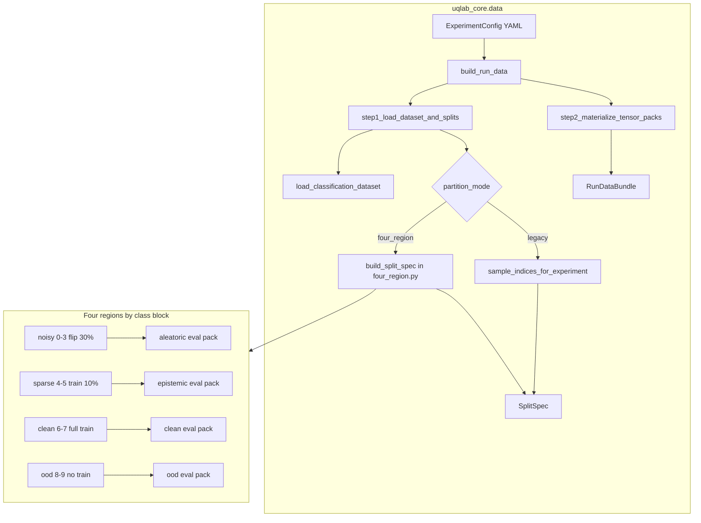
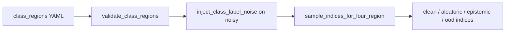

# Data layer (`uqlab_core.data`)

**Start here:**

```python
from uqlab.data import build_run_data

bundle = build_run_data(config, project_root, seed=seed)
# bundle.dataset, bundle.split_spec, bundle.data_pack → runner
```

`uqlab.data` is a compatibility shim — implementation lives in this package.

## Pipeline

One call runs the full pipeline inside [`buildData.py`](buildData.py):

```
build_run_data
  ├─ step1_load_dataset_and_splits   — registry load + index splits
  └─ step2_materialize_tensor_packs  — SplitSpec → torch packs (embeddings or images)
```



## Public API (`from uqlab.data import …`)

| Symbol | Purpose |
|--------|---------|
| `build_run_data` | **Only entrypoint** for notebooks and runner |
| `RunDataBundle` | Result: dataset, split_spec, data_pack, ctx |
| `SplitSpec` | Train/eval index pools (for logging/tests) |
| `describe_four_region_split` | Per-pool eval counts for four-region runs |

Advanced symbols (`step1_load_dataset_and_splits`, `prepare_run_data_context`, …) live in [`buildData.py`](buildData.py).

## Subpackages

| Folder | Role |
|--------|------|
| [`datasets/registry.py`](datasets/registry.py) | **Registry + factory** — protocol, noise helpers, `load_classification_dataset` |
| [`datasets/loaders/`](datasets/loaders/) | Private torchvision loaders (do not import) |
| [`splits/four_region.py`](splits/four_region.py) | **Four-region benchmark** — noisy/sparse/clean/OOD |
| [`splits/experiment_loader.py`](splits/experiment_loader.py) | Legacy splits + `SplitSpec` + DINO feature cache |
| [`buildData.py`](buildData.py) | Load → split → materialize packs (incl. image-mode transforms) |

## Datasets — registry only

```python
from uqlab.data.datasets import load_classification_dataset

dataset = load_classification_dataset("cifar10n", root=path, noise_type="worse_label")
```

Do **not** import from `datasets/loaders/` — those modules are private implementation details.

## Four-region mode

Set in YAML:

```yaml
data:
  partition_mode: four_region
  class_regions: { ... }  # optional; see DEFAULT_FOUR_REGION_PRESET
```

### Region semantics (CIFAR-10 default)

| Region | Classes | Train policy | Simulates | Eval `group` label |
|--------|---------|--------------|-----------|-------------------|
| **Noisy** | 0–3 | Full train; **30% label flip** | Aleatoric uncertainty | `aleatoric_like` |
| **Sparse** | 4–5 | **10%** of training samples | Epistemic uncertainty | `epistemic_like` |
| **Clean** | 6–7 | Full train; no noise | Low-uncertainty baseline | `clean` |
| **OOD** | 8–9 | **Withheld** from training | Out-of-distribution at test | `ood_like` |

Preset definition: [`DEFAULT_FOUR_REGION_PRESET`](splits/four_region.py).

### Region → eval pack mapping

At split time (`sample_indices_for_four_region` in [`four_region.py`](splits/four_region.py)):

| Split region | Eval pack field | `per_sample_signals.csv` group |
|--------------|-----------------|--------------------------------|
| noisy | `aleatoric_eval_indices` | `aleatoric_like` |
| sparse | `epistemic_eval_indices` | `epistemic_like` |
| clean | `clean_eval_indices` | `clean` |
| ood | `ood_eval_indices` | `ood_like` |



Every class `0 … num_classes-1` must appear in exactly one region (`validate_class_regions`).

## Further reading

- [`docs/features/data/data-pipeline.md`](../../../docs/features/data/data-pipeline.md) — YAML → artifacts walkthrough
- [`docs/features/data/four-region-notebook.md`](../../../docs/features/data/four-region-notebook.md) — notebook benchmark flow
- [`docs/features/data/dataset-plugin.md`](../../../docs/features/data/dataset-plugin.md) — adding datasets via registry
- [`docs/features/paper/PAPER_FLOW.md`](../../../docs/features/paper/PAPER_FLOW.md) — full run API map
