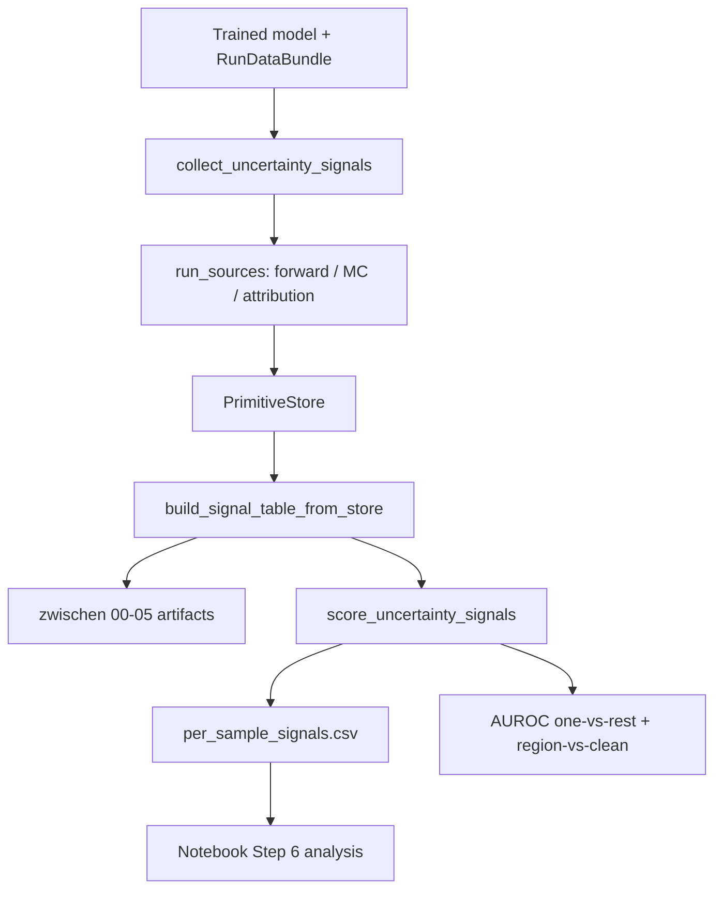

# Evaluation module (`uqlab_core.evaluation`)

Score uncertainty signals after training. Two steps: **collect** (sources → signal table) then **score** (AUROC + CSV).

`uqlab.evaluation` is a compatibility shim for most symbols; extras (`validation/`, `benchmarks/`) remain under `uqlab` only.

## Start here

```python
from uqlab_core.evaluation import run_uncertainty_eval, UncertaintyEvalResult

result = run_uncertainty_eval(
    model, cfg, bundle, results_dir=run_dir, device=device, seed=seed,
)
# result.signal_table, result.eval_summary, per_sample_signals.csv
```

Or call the steps separately:

```python
from uqlab_core.evaluation import collect_uncertainty_signals, score_uncertainty_signals

eval_outputs = collect_uncertainty_signals(model, cfg, bundle, results_dir=run_dir, device=device)
eval_summary = score_uncertainty_signals(eval_outputs, bundle, results_dir=run_dir, device=device, seed=seed)
```

## Pipeline



## Layout

```
evaluation/
├── __init__.py          # lazy exports: run_uncertainty_eval, collect/score
├── pipeline.py          # collect_uncertainty_signals*, score_uncertainty_signals*
├── scoring.py           # AUROC, macro-F1 classifiers
├── signals/
│   ├── catalog.py       # METRIC_META (metadata, families, backends)
│   ├── registry.py      # METRICS compute functions
│   ├── sources.py       # SOURCE_REGISTRY, run_sources
│   ├── attribution.py           # top-k structure (coherence, mass, dominance)
│   └── attribution_distribution.py  # full-vector entropy/participation/...
└── reporting/
    ├── __init__.py      # summary builders, CSV writers
    └── four_region_reporting.py   # box plots from per_sample_signals.csv
```

Notebook analysis tables: [`uqlab/shared/notebook_utils/attribution_distribution_summary.py`](../uqlab/shared/notebook_utils/attribution_distribution_summary.py) (post-hoc; not persisted to `summary.json`).

## Collect vs score vs analysis

| Layer | Module | Role |
|-------|--------|------|
| **Vector computation** | `signals/sources.py`, `attribution.py`, `attribution_distribution.py` | `PrimitiveStore`: influence `[N×T]`, `dualxda.*` primitives |
| **Scalar metrics** | `signals/registry.py` + `catalog.py` | Collapse primitives → `signal_table` |
| **Run scoring** | `scoring.py` + `pipeline.score_*` | AUROC / macro-F1; writes CSV |
| **Notebook analysis** | `attribution_distribution_summary.py` | Pairwise contrasts, distribution tables |

See [`signals/README.md`](signals/README.md) for catalog/registry/sources.

## Core vectors glossary

| Term | Meaning |
|------|---------|
| **Influence matrix** | Full eval×train attribution scores; `zwischen/02_influence_*.pt` |
| **Structure primitives** | Top-k scalars: coherence, mass, dominance → `inverse_*` metrics |
| **Distribution primitives** | Full-row stats: entropy, participation, signed_split, variance → `attribution_*_dualxda` |
| **signal_table** | Final per-sample scalars passed to scoring |

Only DualXDA populates distribution primitives today.

## Pipeline vs notebook scoring axes

| Axis | Pipeline (`_auroc_per_signal`) | Notebook (`attribution_distribution_summary`) |
|------|----------------------------------|-----------------------------------------------|
| Aleatoric vs rest | Yes | Optional pairwise subsets |
| Epistemic vs rest | Yes | `summarize_attribution_distribution` default |
| Region vs clean | noisy/sparse/OOD vs clean | — |
| Custom pairs | — | clean−noisy, OOD−noisy, sparse−clean, sparse−OOD |

## Signal families

| Family | Examples | Source |
|--------|----------|--------|
| Predictive (MC) | `expected_entropy`, `mutual_info`, `msp_uncertainty` | `mc_dropout` |
| Inverse structure | `inverse_coherence_dualxda`, `inverse_mass_ek_fak`, … | attribution backends |
| Distribution (full vector) | `attribution_entropy_dualxda`, `attribution_signed_split_dualxda`, … | DualXDA row stats |

See [`docs/features/evaluation/signal-registry.md`](../../../docs/features/evaluation/signal-registry.md) for enabling metrics in YAML.

## Scoring axes

Group codes in [`run_artifacts.py`](../run_artifacts.py):

| Code | `group` column | Region |
|------|----------------|--------|
| 0 | `clean` | Clean baseline |
| 1 | `aleatoric_like` | Noisy (label flip) |
| 2 | `epistemic_like` | Sparse (under-trained) |
| 3 | `ood_like` | OOD |

`score_uncertainty_signals` (`pipeline._auroc_per_signal`) computes per signal:

- One-vs-rest AUROC (aleatoric, epistemic, OOD positives)
- Region-vs-clean: noisy/sparse/OOD vs `clean`

The four-region notebook adds **custom pairwise contrasts** (mean diff + AUROC) via `pairwise_signal_contrasts` — see below.

## Four-region notebook map

[`notebooks/four_region_benchmark.ipynb`](../../../notebooks/four_region_benchmark.ipynb):

| Step | API |
|------|-----|
| 4 | `collect_uncertainty_signals` + enable distribution signals in `cfg.evaluation.signals` |
| 5 | `score_uncertainty_signals` → `per_sample_signals.csv` |
| 6 | `plot_four_region_metrics_by_group` + `summarize_attribution_distribution` + `pairwise_signal_contrasts` |

## Reporting split

| Layer | Module | Output |
|-------|--------|--------|
| Core scoring | `scoring.py`, `pipeline.py` | AUROC rows, macro-F1 |
| Disk | `reporting/__init__.py` | `summary.json`, `per_sample_signals.csv` |
| Plots | `reporting/four_region_reporting.py` | `analysis/four_region_metrics/*.png` |
| Tables | `attribution_distribution_summary.py` | group means, AUROC, pairwise contrasts |

## Further reading

- [`docs/features/evaluation/evaluation-pipeline.md`](../../../docs/features/evaluation/evaluation-pipeline.md)
- [`docs/features/evaluation/evaluation-protocol.md`](../../../docs/features/evaluation/evaluation-protocol.md)
- [`docs/features/evaluation/ATTRIBUTION_ARTIFACTS.md`](../../../docs/features/evaluation/ATTRIBUTION_ARTIFACTS.md)
- [`docs/features/data/four-region-notebook.md`](../../../docs/features/data/four-region-notebook.md)
