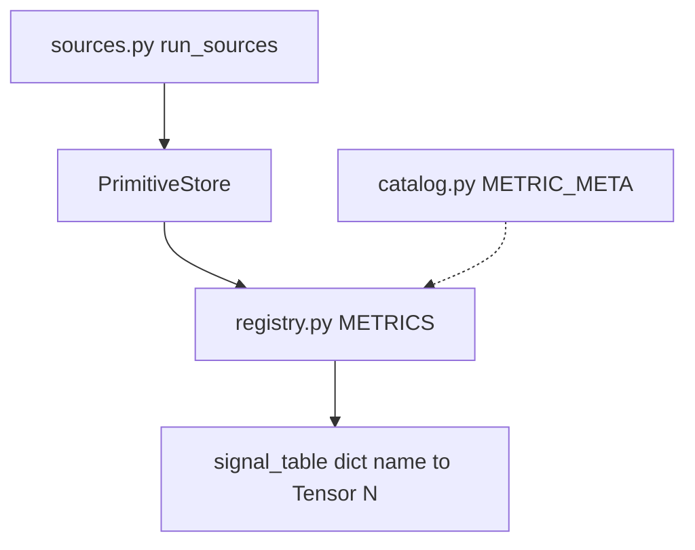

# Signals (`uqlab_core.evaluation.signals`)

How per-sample uncertainty **scalars** are computed from model outputs and attribution **vectors**.

## Three layers

| Module | Role | Torch at import? |
|--------|------|------------------|
| [`catalog.py`](catalog.py) | SSOT for metric IDs, families, YAML/UI metadata | No |
| [`sources.py`](sources.py) | Expensive I/O: forward, MC dropout, attribution backends | Yes |
| [`registry.py`](registry.py) | `METRICS[id].compute(store)` → `[N]` tensor | Yes |
| [`primitives.py`](primitives.py) | `PrimitiveStore` key constants | Types only |
| [`attribution.py`](attribution.py) | Top-k structure from influence rows | Yes |
| [`attribution_distribution.py`](attribution_distribution.py) | Full-row entropy/participation/signed_split/variance | Yes |

## Core vectors (PrimitiveStore)

Intermediate tensors before scalar metrics:

| Key family | Shape | Used for |
|------------|-------|----------|
| `influence.dualxda` (etc.) | `[N_eval, N_train]` | Full attribution matrix; persisted in `zwischen/02_influence_*.pt` |
| `dualxda.coherence`, `.mass`, `.dominance` | `[N]` | Inverse structure metrics (`inverse_*_dualxda`) |
| `dualxda.entropy`, `.participation`, … | `[N]` | Distribution metrics (`attribution_*_dualxda`) |
| `mc.entropy`, `mc.mutual_info` | `[N]` | Predictive uncertainty |

**Structure** metrics use top-k supporters; **distribution** metrics use the entire signed row (DualXDA only today).

## Adding a metric

1. Add `MetricMeta` to `catalog.METRIC_META`.
2. Wire `compute` in `registry._COMPUTE`.
3. If new primitives are needed, extend a source in `sources.py`.
4. Enable in YAML `evaluation.signals` or notebook `cfg.evaluation.signals`.

See [`docs/features/signal-registry.md`](../../../../docs/features/signal-registry.md).

## Collect vs score

- **Collect** (`pipeline.collect_uncertainty_signals`) runs sources + registry → `signal_table`.
- **Score** (`pipeline.score_uncertainty_signals`) applies [`../scoring.py`](../scoring.py) to scalars only — no re-run of attribution.

Notebook post-hoc analysis: [`uqlab/shared/notebook_utils/attribution_distribution_summary.py`](../../uqlab/shared/notebook_utils/attribution_distribution_summary.py).
